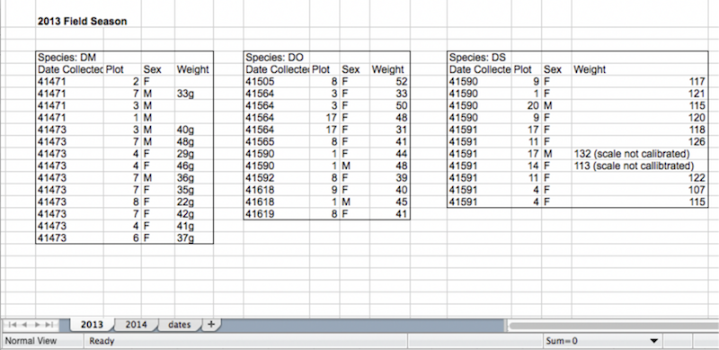
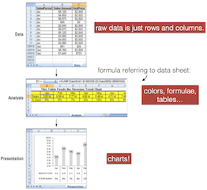

# Week1: Excel Basics

## Intro to Excel and Cleaning Data
### Why Excel?

  * Everyone everywhere uses it in business. 
  * It’s a great tool for exploratory data analysis
  * You can use it to make CSV files for other tools, and use in Python/R/Javascript apps
  * It has some powerful capabilities including charts,formulae, stats, filters, etc
  * It can be used for reporting, analysis, charts, 2 interactivity...

### Data Analysis Skills

A couple background references on being a data analyst:
* [You Can Be a Data Analyst Without Doing Heavy Math](http://www.datascienceweekly.org/articles/you-can-be-a-data-analyst-without-doing-heavy-math)
* [What Excel Skills Does a Business Analyst Need - Quora](https://www.quora.com/What-Excel-skills-and-formulas-does-a-business-analyst-need)

This course is not much about math and stats, and more about data organization, cleaning, and tools needed for basic functional data analysis in the office. We start with important Excel skills that I find many people don't know, and then we move on to SQL (**the most important analyst skill**), and a visual analysis and reporting tool, Tableau.

## Good Spreadsheet Behavior

Most of you are used to pretty formatted tables in spreadsheets, and spend a lot of time making things look nice.  This course is not about that, and in fact, I frown hard at it. If you submit homework with pretty table formatting, I will give you a lower grade.

Your first job is to understand what the "data" is in a spreadsheet. And how to work with it. And how to save it for others to work with it.

Please read: [Data Organization in Spreadsheets, Broman & Woo](http://www.tandfonline.com/doi/full/10.1080/00031305.2017.1375989). This is on the quiz.

### Good practices and bad: multiple tables on one sheet is bad.

### Separating data, analysis and presentation
> One of the most important concepts in a data model is the separation of data, analyis and presentation. The fundamental idea is that you don't want your data to become too tied into any one particular way of presenting that data. 
>
> To get your mind around this concept think about an invoice. When you receive an invoice, you do'nt assume the financial data on that invoice is the true source of your data. It's merely a presentation of data that's actually stored ins ome database. That data can be analyzed and presented yo you in many other manners: in charts, in tables, or even on Web sites. This sounds obvious, but Exce users often fuse data, analysis, and presentation together.
>
>For instance, I've seen Excel workbooks that contain 12 tabs, each reprensenting a month. On each tab, data for that month is listed along with formulas, pivot tables, and summaries. Now what happens when you're asked to provide summary by quarter? Do you add more formuas and tabs to consolidate the data on each of the month tabs ? the fundamental problem in this scenario is that the tabs actually represent data values that are fused into the presentation of your analysis

  *– from the excellent [Excel 2007 Dashboards and Reports for Dummies](https://www.amazon.com/Excel-2007-Dashboards-Reports-Dummies/dp/0470228148/ref=sr_1_2?ie=UTF8&qid=1515603609&sr=8-2&keywords=excel+2007+dashboard) –*

**You Need Minimally 3 Worksheets to separate your concerns:**

1. Raw data is just text rows and columns. No colors, no formulas, no merged cells.  Single table.
2. Analysis: color, tables, formula referring to the data sheet,... 
3. Charts, again on another sheet.

### Common mistakes in data in spreadsheets:

  * Color coded cells without clear data column values (why were they colored?)
  * Merged cells
  * Header rows that aren’t at the top of the data 
  * Multiple tables on one sheet
  * Too many tabs...
  * Metadata about the data on the same sheet
  * Spaces in column headers
  * Bad “null” values (don't have empty cells)
  * Multiple pieces of info in the same cell

More: http://www.datacarpentry.org/spreadsheet-ecology-lesson/02-common-mistakes/

### Presentation is different from raw data
  * “raw data” is the number, values, columns, rows... in plain format
  * Cells that are colored, highlighted, footnoted, graphs etc — are presentation and analysis tools, not the raw data.
  * The stuff that is saved in CSV files (plain text) is the raw data.
 
 :zap: Questions about this are on the quiz. :zap:

### Why Does Raw Data Matter? 

* Raw data is useable in multiple types of analysis, including reading in code like Python, R, or inserting into a database.
* Well-formatted data can be used in Pivot tables in Excel -- data with "extras" like summary rows or merged columns can't be used in pivots easily.
* Raw data can be saved as a simple text format (like CSV or TSV) for exchanges with other programs/people.
* Data that is not "raw" contains things can produce errors, like formulas, or hides important information (hidden columns and rows, formatting).

**Raw data is as close to plain text form as possible.  If you have pretty table formatting, colors, etc, your data is NOT RAW.**

Please read: [Data Organization in Spreadsheets, Broman & Woo](http://www.tandfonline.com/doi/full/10.1080/00031305.2017.1375989)

Among their advice:

* write dates like YYYY-MM-DD, 
* don't leave any cells empty,
* put just one thing in a cell, 
* organize the data as a single rectangle (with subjects as rows and variables as columns, and with a single header row), 
* create a data dictionary, 
* don't include calculations in the raw data files, 
* don't use font color or highlighting as data, 
* choose good names for things,
* and save the data in plain text file (e.g., CSV or TSV format).

### Excel UI Tools

#### Windows looks very different.  (It’s actually better, too.)

Filter is on home tab   

Insert Tab has charts/pivots on it....  

The Data tab....   

#### Mac Excel is different
Right click on top toolbar to customize it...   

The Data Tab has filters, Pivots, Text to Columns, etc...  

**Make sure all your tabs are showing.**

  * Excel Preferences.... 
(under File **menu on Windows**, or the **main app menu on Mac**)

  * Click on Ribbon   
   

  * Be sure to scroll this window and check all of them.  

  

Go To [Importing Data and Date Types](importing_dates.md).

## Key UI Tools You Must Understand in Excel for Data Cleaning & Reporting

 * Sorting and Filtering columns
 * Find-and-Replace in Columns
 * Text-to-columns (used to split one column into many columns using some separator like a comma)
 * Formulas to clean data
 * Paste-Special (for paste as "values")
 * Pivot tables (tables croisées) -- we will do next week.

## Filtering and Sorting

:zap: **YOU MUST MASTER THIS.** :zap:   

[Filter and Sort video](https://youtu.be/Mdvu1EziwRM)
  
On Windows, over on the right side of Home. (Select all your columns first.)  
    

Mac - the DATA tab.
   

**You should be sure you select ALL the Columns before you pick the Filter icon.**

1. Click this triangle, it will highlight all of them.
2. THEN select the filter icon (it will be on Data tab or Home).
3. You should see the little sorting arrows on each column if you did it right.
 

###### Exercises
Import the CSV version of ChiCrimes data (Chicago crime data), if you haven't yet.

Open ChiCrimes data and try filters:

   

*A nice feature in recent Excels – saves you time and helps you troubleshoot your data:*     
    
*On Mac, you can pick one to show - sum is default, I think. Change to count.*

### Filters can be combined with sorting to get answers to questions.
1. Filter to show only Primary Type Burglary.
2. Then sort by Date, Ascending.
This puts the earliest date/time for the burglaries first, and the latest last.

 

*What is the last burglary in this data?*

Reminder: [Filter and Sort video](https://youtu.be/Mdvu1EziwRM)

###### Exercises in Class:

 So, using filters, tell me... ln the Chicago crimes:  
  * What dates does this data cover?
  * How many offenses occurred at Animal Hospitals?
  * Did they occur at the same one?
  * What about at Airports? Did they occur at the same one?
  * Find all offenses that occurred anywhere on Whipple Street:   
  (Hint : Use a search or text filter.) 
    * How many where there? 
    * How many Whipple locations are there?
  * Look at just Sexual Offenses. Can you see anything interesting here?

*Warning: Don’t forget you might have filters in action and not see your whole data set. To turn off all the filters, just hit the filter button again:*

### Useful for counting: Remove Duplicates

A useful trick - removing duplicates to see what your unique field values are.
  
 

Video: [Remove Duplicates](https://youtu.be/SRpAdtKNXSY)

## Cleaning Data

### Data is Often “Messy”.

 * Missing data
 * “Bad” values for missing data (e.g., a string code)
 * Non-normalized (names not upper case, “Street” vs “St.”)
 * Misspellings (or inconsistent spellings)
 * Dates aren’t of type “date” but of type “text” or “general” 
 * Merged fields — entire address in one cell, etc

***Recent Example***
Gene study errors blamed on Excel types.  
http://www.bbc.com/news/technology-37176926

We will "clean" it in the homework and now, using a copy of the data in a new tab.
 
### Basic Approach to Cleaning

>The basic steps for cleaning data are as follows:
>
>1. Import the data from an external data source.
>2. Create a backup copy of the original data in a separate workbook (or tab)
>3. Ensure that the data is in tabular format of rows and columns with: similar data in each column al columns and rows visible, and no blank rows within the range. For best resultats, use an Excel table.
>4. Do tasks that don't reaquire column manipulation first, such as spell-checking or using the Find and Replace dialog box.
>5. Next, do tasks that do require column manipulation. The general steps for manipulating a column are: 
>      * a. Insert a new column (B) next to the original colun (A) that needs cleaning.
>      * b. Add a formulat that will transform the data at the top of the new column (B).
>      * c. Fill down the formula that will transform the data at the top of the new column (B). In an Excel table, a calculated column is automatically created  with values filled down.
>      * d. Select the new column (B), copy it, and then paste as values into the new column (B).
>      * e. Remove the original column (A), which converts the new column from B to A.

*- https://support.office.com/en-us/article/Top-ten-ways-to-clean-your-data-2844b620-677c-47a7-ac3e-c2e157d1db19 -*

### Recap of that:
  * Copy raw data to a new tab/sheet or workbook. 
  * Work on that copy to clean it.
  * Use filters, do find/replace, etc on existing columns
  * Do things with formulae next: insert new column, copy formulae down, select and copy results, paste-as-vaues. Delete extra column.

Video examples: 
  * [Copy Data to new sheet](https://youtu.be/68onYmEcFdo)
  * [Data Cleaning with Find/Replace](https://youtu.be/hqP_3A1qcmI)
  * [Data Text Changes with a Formula](https://youtu.be/RoWn9s-lo_M)

***More Articles***

https://breakingintowallstreet.com/biws/cleaning-up-data-in-excel/   
(strong reference sheets for keyboard shortcuts)   
http://trumpexcel.com/2014/08/clean-data-in-excel/   
Extensive tutorial:  
http://schoolofdata.org/handbook/recipes/cleaning-data-with-spreadsheets/   

### Cleaning: Text Replacements

 

These are not numbers. 
We can clean by hand and/or using formula or find/replace.

***See Problem 4 of this: http://schoolofdata.org/handbook/recipes/cleaning-data-with-spreadsheets/***

Also see video: [Clean column with replace](https://youtu.be/hqP_3A1qcmI)

### Cleaning: How to Split Columns by A Character (Text-To-Columns)

You usually want one item of data per column.  Sometimes you need to simplify the data you have loaded, and separate items.

For Homework, you need to split this column into two.   
Create two columns from one, using a bunch of tools:

  

*How could we split this into Latitude and Longitude?*

#### Hints
  * Work on a new tab with a copy of your data!
  * Use text-to-column (split by comma) See video above. 
  * Select each resulting column and replace the “)” or “(“ by nothing 
  * Label the new columns as requested.

See video: [Text to Columns](https://youtu.be/xs4QmuhFgSo)

## Formulae

### Text and Data Formulae to Clean 

Trim removes whitespace!
Proper makes title case.  Example in this video of cleaning a column to fix the case to "proper." (In French, "nompropre".)

Site with formula translations: http://dolf.trieschnigg.nl/excel/index.php

Video: [Changing Text with Formula](https://youtu.be/RoWn9s-lo_M)

    

> Also see video in https://breakingintowallstreet.com/biws/cleaning-up-data-in-excel/ 
 
### Reminder about Formulae Cell References

Remember: 
  * A2 : relative reference : both may change when you copy the formula.
  * A$2 : fixed row, relative column -- will change when you copy column.
  * $A2 : fixed column, relative row -- will change when you copy row.
  * $A$2 : fixed column and cell, will not change when you copy formula.

> http://www.gcflearnfree.org/excel2013/relative-and-absolute-cell-references/2/ 

  
### Use a Formula to Extract Text

Let’s try to split up the data on the street address for Chicago crimes.  
Copy the block column onto a new sheet. Enter this formula (but the french version, probably "trouve(‘ ‘;A2)"... in b2:  

Then you can use another formula to get the right end of the string,

* RIGHT(text, number_of_chars) [French: DROITE]
* LEN(text)  [French: NBCAR]

How would you combine them?  In one formula. Work with me!

Read: https://spreadsheeto.com/text-functions/

### After Formula Use: Paste As Values  

After you finish your formula and get your results, it’s very important to copy the data and paste it as values — because leaving a formula in a cell can cause bad problems.
 

  

### Problem with Formulas

Why is it bad to leave formulas in the workbook in your cleaned data?

  * They are not obvious to a reader of the sheet - you have to put your mouse in a cell to see them
  * If you move a column or cell, you can destroy the formula without noticing it. (The references will break)
  * It is easy to “mess up” your formula with an accidental click in a cell containing one, and then you have lost important data

After doing this operation...  
    
You should have both columns - the original, and the new derived column (pasted as values, no formula in the cell!)
 
## Saving as CSV: Remember Format

  
Then you must say “continue” to the dialogs afterwards.... 

**WARNINGS**

  * When you save as CSV - make sure there are no filters applied.
  * If you save a filtered data table, it will save only the visible rows.
  * You will save any date strings in the format that is visible. This means you may lose information (minutes, seconds) if you aren't showing enough precision.
  * Save with a new filename, so you don’t overwrite the original data!

Video: [Save as CSV](https://youtu.be/uJ_cSdF8hkk)

After you have saved in CSV format, your workbook is called filename.csv. You will want to save it as an Excel workbook too, to save all the tabs! 

Note: In France/Europe, the format is more commonly ";" delimited, not "," (virgule), because of number formatting.  This is ok too.
