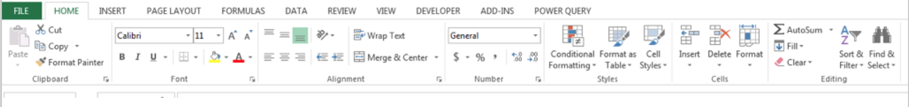
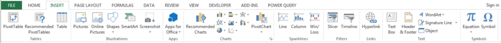
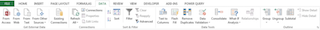
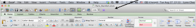
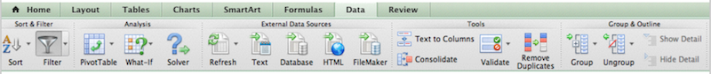
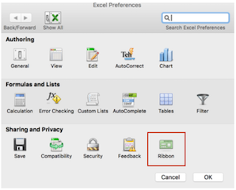
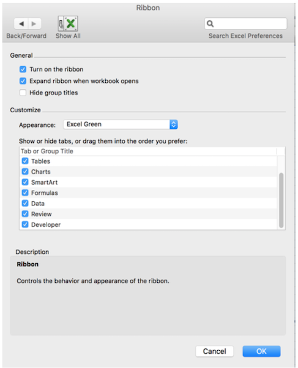
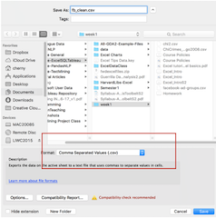

# Week1: Excel Basics

## Intro to Excel and Cleaning Data
### Why Excel?

  * Everyone everywhere uses it in business.
  * It’s a great tool for exploratory data analysis
  * You can use it to make CSV (comma-separated value text) files for other tools, and use in Python/R/Javascript apps
  * It has some powerful capabilities including charts,formulae, stats, filters, etc.
  * It can be used for reporting, analysis, charts, interactivity...

### Data Analysis Skills

A couple background references on being a data analyst:
* [You Can Be a Data Analyst Without Doing Heavy Math](http://www.datascienceweekly.org/articles/you-can-be-a-data-analyst-without-doing-heavy-math)
* [What Excel Skills Does a Business Analyst Need - Quora](https://www.quora.com/What-Excel-skills-and-formulas-does-a-business-analyst-need)

This course is not much about math and stats, and more about data organization, cleaning, and tools needed for basic functional data analysis in the office. We start with important Excel skills that I find many people don't know, and then we move on to SQL (**the most important analyst skill**), and a visual analysis and reporting tool, Tableau.

## Read Section: [Good Spreadsheet Data Behavior](good_spreadsheets.md)

### Excel UI Tools

#### Windows looks very different.  (It’s actually better, too.)

Filter is on home tab   

Insert Tab has charts/pivots on it....  

The Data tab....   

#### Mac Excel is different
Right click on top toolbar to customize it...   

The Data Tab has filters, Pivots, Text to Columns, etc...  

**Make sure all your tabs are showing, including Developer.**

Video: [Windows 2016 French Excel Options](https://youtu.be/ry1q9lDiKgI)

  * Excel Preferences....
(under Fichier Options menu on **Windows**, or the **main app menu on Mac**)

  * Click on Ribbon   
   

  * Be sure to scroll this window and check all of them.  

  

## Read Section: [Importing Data and Date Types](importing_dates.md).

## Key UI Tools You Must Understand in Excel for Data Cleaning & Reporting

 * Sorting and Filtering columns
 * Find-and-Replace in Columns
 * Text-to-columns (used to split one column into many columns using some separator like a comma)
 * Formulas to clean data
 * Paste-Special (for paste as "values")
 * Pivot tables (tables croisées) -- we will do next week.

## Section: [Filtering and Sorting](filtering_sorting_dupes.md)

## Section: [Cleaning Data](cleaning.md)

## Section: [Formulae](formulae.md)

## Saving as CSV: Remember Format

  
Then you must say “continue” to the dialogs afterwards....

**WARNINGS**

  * When you save as CSV - make sure there are no filters applied.
  * If you save a filtered data table, it will save only the visible rows.
  * You will save any date strings in the format that is visible. This means you may lose information (minutes, seconds) if you aren't showing enough precision.
  * Save with a new filename, so you don’t overwrite the original data!

Video: [Save as CSV](https://youtu.be/uJ_cSdF8hkk)

After you have saved in CSV format, your workbook is called filename.csv. You will want to save it as an Excel workbook too, to save all the tabs!

Note: In France/Europe, the format is more commonly ";" delimited, not "," (virgule), because of number formatting.  This is ok too.

## [Week1 Homework](homework.md)
