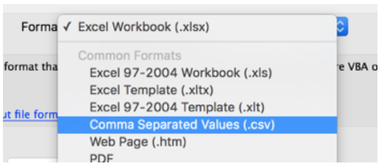

## Importing Text Data Into Excel and Types

### CSV Import

We need some data to start with.  A common "raw data" file format is CSV, or "comma separated values."  (In France it is usually ";" separated.)

*VIDEOS*:

>Mac English Excel Video: [Import CSV](https://youtu.be/7U5WgW_mQ8o)
>Windows French Excel 2016: [Import CSV](https://youtu.be/eB2NR0P55r0)

It is very common for a raw data set to be in a text format, not excel. Usually it will be in “CSV” or “TSV” format — “comma separated values” or “tab separated values.”

The difference is the character that separates the columns of data — for instance, this is CSV data with 2 columns (and no “header” title on the first row):

   

#### Importing steps (Mac, English)

(See the video links above for other formats.)

1. Click on File menu, then “Import....” and make sure this dialog says CSV:

   

2. If it is “tab separated”, you could choose text. But you can also use CSV for tab separated data.
 

2.a. It's important to change the source menu if you are using a data file from a region with a different currency or date format.  This seems to be the key to converting for your own regional display correctly.  For instance, using a file from the US, in a French copy of Excel:

On Mac, importing a French file into American Excel, I have to choose something for European (no french option shows).

2.b. Here you specify what the character delimiter is between your data columns. You can type in a special one in "other".

   

  
3. The “Types” Dialog:

You can also change your data types after importing, but there is one important issue here: **decimal number format**.  

   

Click on “Advanced...”

This issue caused a lot of difficulty to students last semester.  

  

:zap: :zap:  **All of my data files use international formatting for decimals: “point” or “dot”, not “comma.”** :zap: :zap:   
Make sure you change this to match my settings when you import text data with numbers.

4. The last dialog - if you are in a blank new workbook, use $A$1:
 
  

#### alternatively... some Excel versions can open CSV files for you:

In a blank workbook, click File menu, choose Open.... and change the dialog to show or enable “All files”:  

  

Navigate to and click on **ChiCrimes_Chicago2008.csv** to open it.   
Hopefully it will understand the csv format and load it correctly for you:
 

###### If it does not... all of it will be in one column, with no headers.

Then you can split the single column using the same dialogs, accessible from the “text to columns” button (under Data in Mac Excel, maybe home on Windows?)

Video: [Text to Columns](https://youtu.be/xs4QmuhFgSo)
 
  

## Verifying: Date/Time types

When you import a CSV file, make sure you know the origin for date and currency handling.  You should set the origin when you import:

Video: [Importing French Data into American Excel](https://youtu.be/HxRai7NZH50)
Video: [Importing French Data into French Excel with US Settings](https://youtu.be/HxRai7NZH50)

The data type is very important in Excel.

Put your mouse in a column, and check the type in this dropdown.  

  

### Dates - Beware: 
When we import from CSV (or other text formats), Excel may guess “wrong” for the date/time fields.

> **A common problem**  
> One issue people frequently run into is that Excel occasionally misinterprets text fiels as dates.  
> An example is here :  
>    
> Be careful when entering dates, especially if you are importing from other data sources, to make sure that you "Jan-13" is being stored as January 13, 2013 !
***- http://www.exceltactics.com/definitive-guide-using-dates-times-excel/ -***
 
### Field Types - Especially Dates

### Formating Times as Custom...

Choose the time format you prefer from the Custom dialog.  
Try this with me on the Dates tab in the **ChiCrimes** file. 
Change the time to show am/pm.   
You must select the entire column, not just a single cell!  
Do that by clicking the C on top.  
Then choose “Custom...”
 
   

You should have a date option that includes AM/PM in the time.

   

###### What if we wanted the date and time in different columns?
Hint: Copy the Date column to 2 new columns. Reformat them.  
Rename the original col to “date-time” and the other 2 to “Date” and “Time”. Or use formulae.
  
   
Notice that when you mouse in a cell, you see the full date information.

### Now save this edited data as CSV. Call it “chi2.csv”.
  * Save As...  
  * Pick format CSV  
  * Give it the name “chi2.csv”

Video: [Save as CSV](https://youtu.be/uJ_cSdF8hkk)

*Note: you are going to upload this file after the exercises, so make sure you do this and work in it now.*
 
Now open that new file you made. What do you see about the new “Date” and “Time” columns now?

**This is why we kept the original column with both...**  

Excel format saves more info than csv. CSV is a text format that preserves **only the text visible** in the cells.   
That’s why format types matter so much in the display in the cell. Make sure you have your data formatted with the info you need.

### More Advice for Dates

  * The advice in Browman & Woo is to save your dates in the international standard YYYY-MM-DD.
  * Article: [Dates as Data](http://www.datacarpentry.org/spreadsheet-ecology-lesson/03-dates-as-data/)
  * Store your day, month, year separately (allows some special analysis by each) &/or
  * Be sure text fields are interpreted as date types correctly