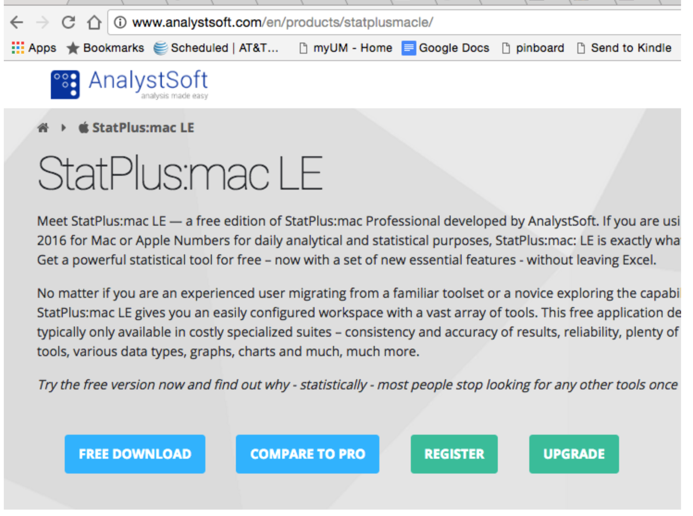
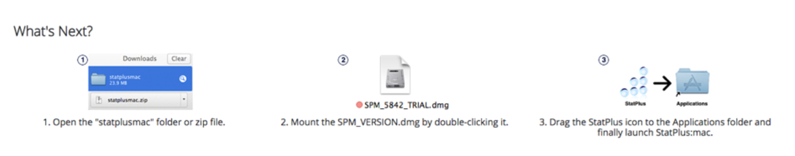
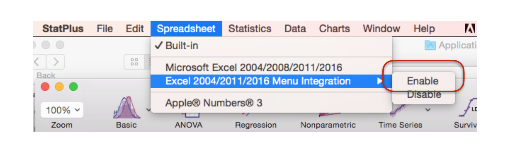
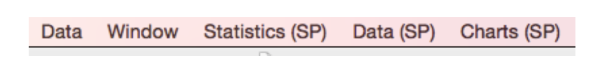
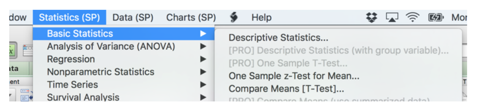
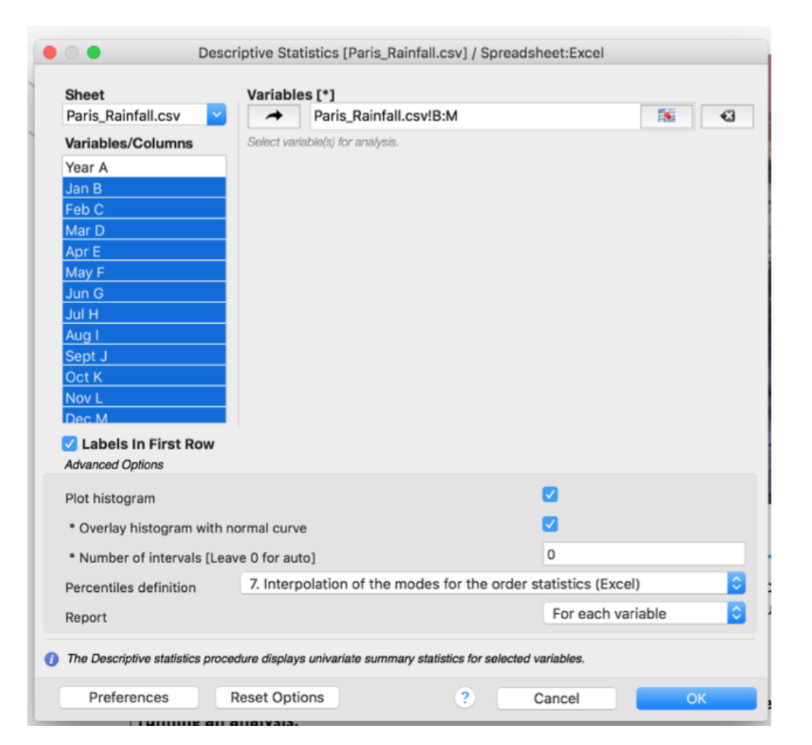
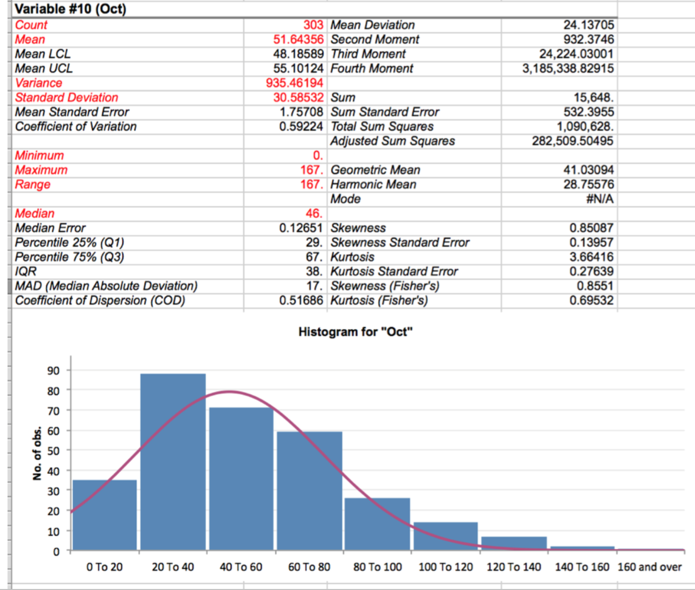

## What are descriptive statistics?

Simple “overview” numbers about a data set.
 * Count, type, # of blanks in each col
 * Quantitative data: avg/mean, median, stdev...
 * Categorical data: number of each value  

## Check your types & missing data

What kind of data is in the column?
* If it’s quantitative (numbers) - leave missing values blank. (This is controversial. Browman and Woo prefer an indicator like "-" or "NA"). Math will work better with missing values instead of mixed values in numeric columns.
* If it’s strings/text, label missing values as “unknown” or “missing” or "NA" if you want. If the text is “category” or “label” data, try to be consistent so you can count these or group them.
* Try not to mix types... Excel won't like this.

## Add-ins that help profile your data

* Analysis Toolpak add-in on Windows Excel and
Mac Excel 2016
* On Mac Excel 2011, a third party solution: StatPlus
* Also the Toolpak add-in to Google sheets

### Analysis Toolpak on Windows

[Link to Toolpak info](http://www.excel-easy.com/data-analysis/analysis-toolpak.html
)

Video: [Adding the analysis toolpak into your Excel on Windows](https://youtu.be/ZiwVY9DZ6RQ)

Go to Fichier, "Options", "Complements", and click button "Atteindre..."

## Descriptive Statistics in Windows

This will only work on numeric data.  You must be sure to remove all non-numeric data from the column before you can use the feature.

In the Facebook data column for audience size, you must remove rows that have "-" or a word in them.  (Hint: Use filters and sorting to find them.)

Video: [Removing non-numeric rows](https://youtu.be/8WdZciRZkuE)

## Add-In on Mac

StatPus:

Run the app, then add it to Excel from its menu:

Relaunch Excel after choosing “Enable”. You should see these menus added on top...

Import a file with numeric data, like Paris_Rainfall.csv.

Pick Descriptive Statistics from the menu:

Add as many columns as you want to analyse (select on the left, click the arrow on the top).

Choose to include the histogram (option at the bottom).  It will computer results in a new spreadsheet for you.

Example (red highlight is mine, indicates items of special interest).

