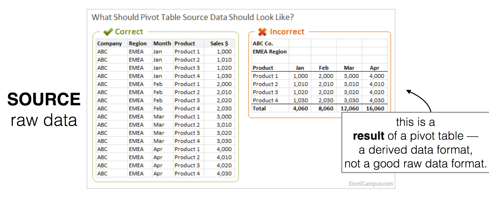
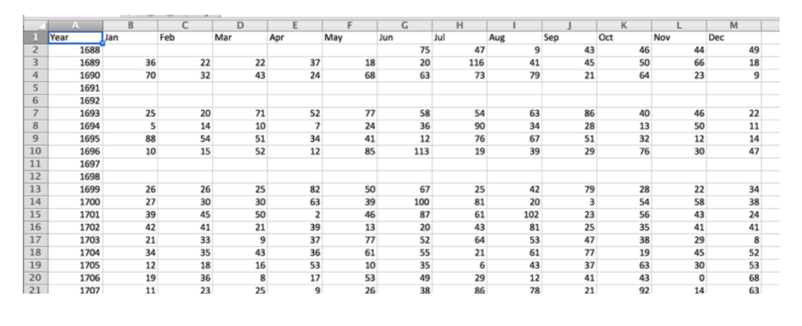

# Tidy Data (Long Form)

Origin of the term “Tidy Data” is probably Hadley Wickham: [Tidy Data Paper](http:// vita.had.co.nz/papers/tidy-data.pdf)

* Also sometimes known as “tall” or “long” or “normalized” instead of
“wide” data or tabular data
* Tableau, when we get to it, also requires tidy LONG (unpivoted) data
* Pivot tables require tidy, long data

* Setting up source data for pivots in Excel: https:// www.excelcampus.com/modeling/structure-pivot-table-source-data/

*from excelcampus article above.*

## Homework Problem

You will work through tidying the data in the file "survey_data_spreadsheet_messy.xlsx."  Follow the principles in these notes on formatting data in a tidy way:

[Data Carpentry Lesson 1 on Spreadsheets](http://www.datacarpentry.org/spreadsheet-ecology-lesson/01-format-data/)

* What are the different sheets?
* Where’s the source data?
* What’s wrong with the fields in some columns?
* What are the columns you would have if you made this tidy?

Your goal is a single table for all the data.

 > columns = all variables (what are the things that are different per observation?)
 >
 > rows = observations — a single record with columns describing it uniquely
 >
 > cells = data (the values of the variables in the column names

## Unpivoting Pivoted Table Data

Sometimes you are given data that is not in tidy format and you have to "fix" it.  There are some tools that will help you unpivot data, but it can be tough.

Look at Paris_Rainfall.csv:

What would a tidy version of this look like?  We want a long table, with 3 columns: Year, Month, Value.

### Unpivot Tools

#### [Google Sheets Add-in](https://stevebennett.me/2015/01/06/normalize-cross-tabs-for-tableau-a-google-sheets-script/)

#### Windows Only Options

* [Tableau Plugin-windows only](http://kb.tableau.com/articles/knowledgebase/addin-reshaping-data-excel?lang=en-us)
* [PowerQuery add-on for Excel-Windows only](https://www.microsoft.com/en-us/download/details.aspx?id=39379)
* Pivot Table Wizard - Windows (Seems to be disabled in latest version?)

#### Using VBA Code (both platforms)

Make sure your Developer tab is in the ribbon.  Use Preferences or Options to turn it on if not.

The macro code you need is in the data file "ReversePivotTable_macro.vba.txt."

[Macro Source Link: Creating a Database Table from a Summary Table](http://spreadsheetpage.com/index.php/tip/creating_a_database_table_from_a_summary_table/)

Demos:
* [Video of Running the Macro on Mac Excel](https://youtu.be/dpnIwhmmbLA)
* [Video of Running the Macro on Windows Excel](https://youtu.be/D10U0I9dh50)
