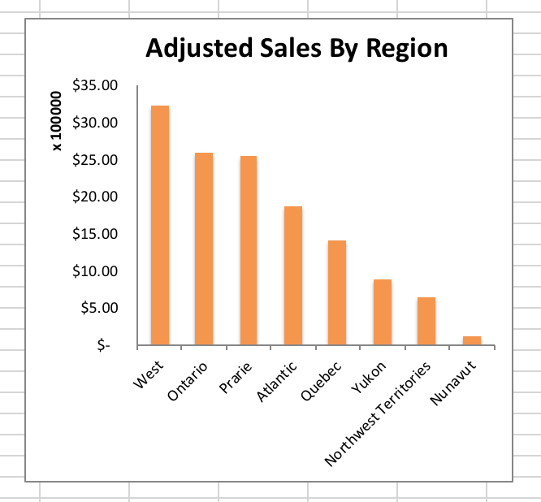
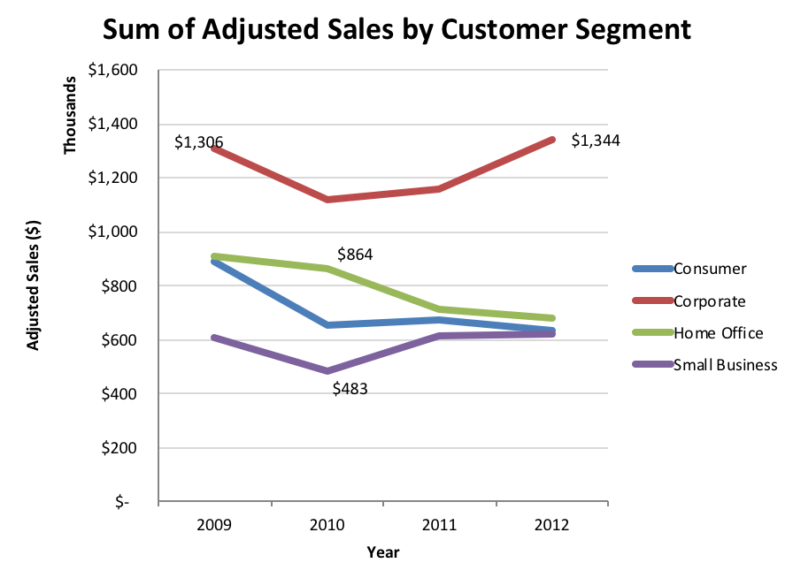

## Homework Week3

SuperStore sales

Use the returns tab to add a column to the Superstore Sales data showing if it was returned or not. Make sure there are no “errors” in it. This means use a formula to put “Returned” or “Not Returned” in a new column.
You will use VLOOKUP and the returns tab for
each sale.

Then add a new calculated column showing the Adjusted Sales after the returns — assume it’s now sales “0” if the item was returned, otherwise repeat the sales value. (Try an “if” statement.)
Make a copy of the formulae data sheet on a new tab, but do “paste special, values” to remove all the formulaes. Call this tab “final sales”.

On a new sheet called "Answers", answer these questions:
* What is the Total Adjusted Sales after this fix?
* How many unique return Order Id’s are there? (Hint: unique.)

Re-create this chart below on another tab or tabs, using your new data adjusted for the returns (make a pivot with Region, Adjusted Sales). Format it as shown. (If you can’t figure out how to get the axis formatting right, make sure you label the Y axis with the units and currency.)

Make another chart on another tab or tabs with this formatting for sales over time by customer segment, using year grouping, and label some outlier points:

Make a new chart of this data for something you think is interesting to show.

Format it nicely according to principles we reviewed in class and in the notes.
Remember x and y axis labels, add a good title.

Tell me why it’s interesting in the cells beside it. (This is part of your score.)

### Reminders:

* Label all your sheets(tabs) in your workbook.
* You should have copies of your original data to work from in the spreadsheet,
and several names sheets (formulaes, clean version after work with no formulaes (paste-special values))... charts...
* Label your axes with units ($, thousands) etc. with a text label and formatting of the numbers on the ticks.
* Upload the entire superstore.xlsx file with all your new tabs.

There will also be a quiz due Monday on the chart reading design principles.
