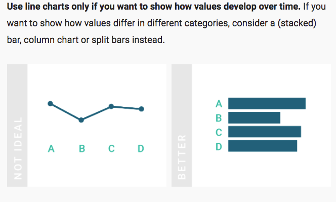
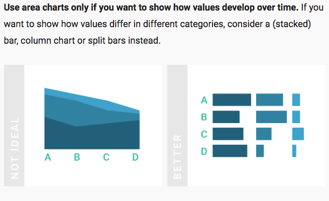

# Design Principles for Good Charts

## Why Do We Need Charts?

*Anscombe’s Quartet: http://en.wikipedia.org/wiki/Anscombe's_quartet*

Updated with a great paper [here](https://www.autodeskresearch.com/publications/samestats).

Identifying patterns is often easier with visual aids.

*N.Yau, Data Points* book.

 > “A visualization is more effective than another if the information is more easily perceived in it than in the other.”  

*Paraphrase of Jock Mackinlay, from full quote in A. Kirk’s book*

## Visualizing Data

Leverage our amazing perceptual system....  

 *Slide above from Noah Iliinsky*

(Slide above from Alberto Cairo)

 Bar charts are safe for almost everything, but....
>“There’s a strand of the data viz world that argues that everything could be a bar chart. That’s possibly true but also possibly a world without joy.”

*Amanda Cox, NYT (paraphrased)
http://freakalytics.com/blog/2013/05/10/joyful-circle-charts-or-informative-bar-charts-best-practices-in-visual-analytics/*

## Design Choices

##### Example:
  * Political Exaggeration: Puerto Rican Crime Drop

From this chart:

To this chart:
  

*http://esolutionspr.com/DataVisualization/CrimeStatsChartAsPublished.png   
10 redesign by Alberto Cairo*

**Bar Charts always start their Y axis at 0!**  
Otherwise they are lying.  
:zap: *This will be on your quiz.* :zap:

## Visual Encodings

  
*N.Yau, Data Points*

Recommended!  
  
*The Wall Street Journal Guide to Information Graphics – The Dos and Don′ts of Presenting Data, Facts, and Figures ; from Dona M. Wong*

## Chart Types

  

## (The Problem with) Pie Charts

You need to read: [What to Consider When Creating Pie Charts by Lisa Rost](https://blog.datawrapper.de/pie-charts/)

*Wikipedia entry on pie charts*

### 3D Distortion

*From Andy Kirk’s book **Data Visualization** *

*Fig 6-11,from Iliinsky & Steele book, Designing Data Visualizations*

Pie Chart Rules:
>Don’t use them if you have more than 3-6 wedges, and label your wedges with the values. Avoid if you can, especially if any of the wedges are really tiny and hard to tell apart.

>Do not use 3d effects on pie charts (or other graphs).

## Line charts

Use line charts for changes over time.  This means your X axis is ordered by time values.

Image from the article [What To Consider When Creating Line Charts](https://blog.datawrapper.de/line-charts/) by Lisa Rost which you should read.

## Area charts

Don't use area charts unless the items you show "stacked" are meant to be added together to see a total.  The problem is that it is hard to see the size of each item alone in the stacking.

Read [What To Consider When Creating Area Charts](https://blog.datawrapper.de/area-charts/) by Lisa Rost.

### Design Process Thinking Tips  

*N.Yau, Data Points*

Read also [What Questions to Ask When Creating Charts](https://blog.datawrapper.de/better-charts/), by Lisa Rost.

The Data-Ink Ratio: Design Guidelines.

[Link to gif](https://www.darkhorseanalytics.com/blog/data-looks-better-naked).

## More Excellent Resources

* Mentioned last week, "Mean vs. Median" by Lisa Rost (again): https://blog.datawrapper.de/weekly-chart-income/
* Andy Kirk's [chart maker directory](http://chartmaker.visualisingdata.com/): what tools make what charts.
* Andy Kirk's blog and [Resources page](http://www.visualisingdata.com/resources/).
