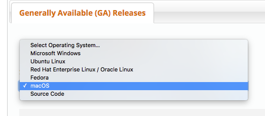

## Installing a Client for MySQL

MySQL Workbench works on Mac and Windows:
Scroll down and pick your platform on the  [download](https://dev.mysql.com/downloads/workbench/) page.

The UI is a little confusing but it's free and multi-platform.

Other options:

* On Mac, I like SQL Pro. [Site page](http://www.sequelpro.com/).

* Heidi SQL should run on most platforms. [Site Page](https://www.heidisql.com/download.php).

* There is also Toad for MySQL, not sure if it runs on both Windows and Mac (make sure you get the right one): [Downloads](http://download.cnet.com/windows/quest-software/3260-20_4-84752-1.html)

* DBeaver is multi-platform (no idea if it's any good): [Site](https://dbeaver.jkiss.org/)

## After Installation

Your goal is to make a new connection to the course server in the cloud.  I will post the URL and account info on Brightspace.
