# SQL and Databases

## Why not use Excel for everything?

  * READ: http://schoolofdata.org/2013/11/07/sqldatabases-vs-excel/  
  * It doesn’t scale well to large data or multiple tables  
  * Doesn’t allow working with multiple datasets easily (VLOOKUP is a hack to help fix this)  
  * Mistakes are easy - just one cell formula error and you are toast.  
  * Collaboration is hard. Copies of spreadsheets are scary.

## What’s a Database?
Here's a picture of a server, like MySQL or PostgresQL, that you connect to with a “client.”

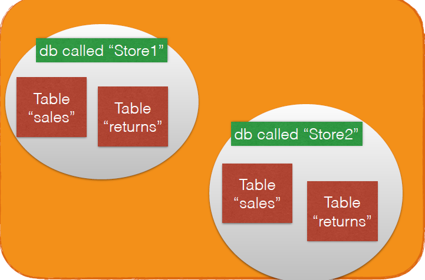

**A server may contain several databases. Each database has tables in it, with columns. Each table is like an Excel sheet of raw data.**

A Good Overview Article (way more technical than we need)
http://www.elated.com/articles/mysql-for-absolute-beginners/

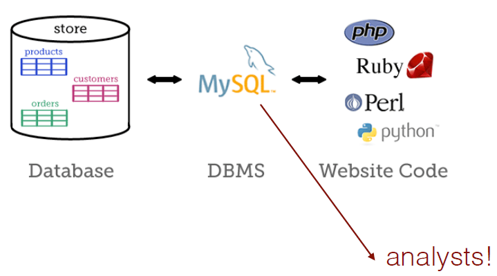

## SQL database structure
  * Like Excel, you have tables with columns and rows
  * SQL tables are ideally “long” and “tidy” data —
each row is a data row, each column is a variable
  * It’s better to have more tables and do joins than try
to squeeze everything into one table.
  * You can get your results out of a SQL query as a cvs file to do graphs in Excel. This is a common workflow.

## Database design
  * Read http://joshualande.com/database-normalization

  * One “topic” per table. That way fewer errors occur
when changes in the data happen.

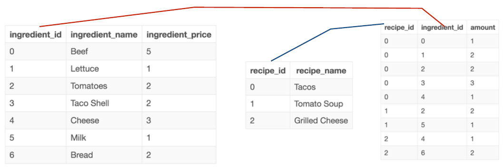

## SQL varieties
  * MySQL - opensource, more common in startups
  * T-SQL (Microsoft server sql) - common in biz
  * PostgresQL (better for text, big data, json…) - also
common in data science startups
  * SQLite - runs without a real “server” (more simple to
install and run, e.g., in browser or apps)

We won't be creating tables in class but you can read http://joshualande.com/create-tables-sql.  
Also, note that some clients allow you to do it with cvs data.

## Simple queries
  * Do the tutorial in https://sqlbolt.com/lesson/select_queries_introduction - you will do Lessons 1-4 on Simple Select queries, filtering, and constraints. This will allow you to do the HW.

  * Single table queries - with filters, limits, and ordering:

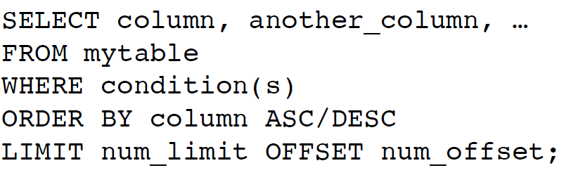

Interested in more practice ? Try the lessons here http://www.w3schools.com/sql/sql_intro.asp

## For class: SQL Client

You should have already installed a client. [See recommendations here.](InstallClient.md)

The Brightspace module shows you how to create the connection to the class MySQL server and pick a database.

Pick as your database the Chinook database, the second one in the class list:

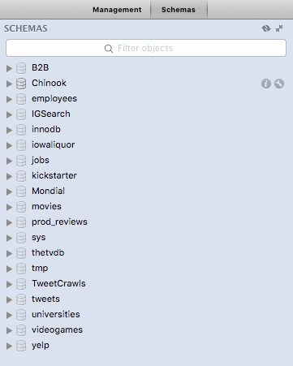

**Inspect the tables**  
Double click on a table to see the structure and data.

Expand the levels to see the tables and the table columns:

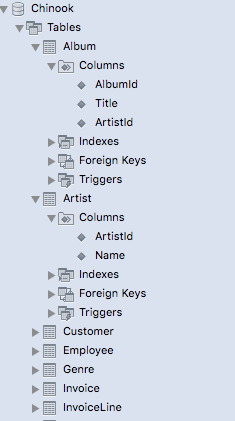

To get a view of what's in a table, you can hover and click on the icon to the right edge, in MySQL Workbench:

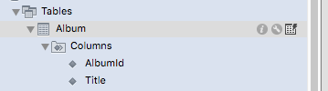

This will open a window where it executes the query and shows you the table contents:

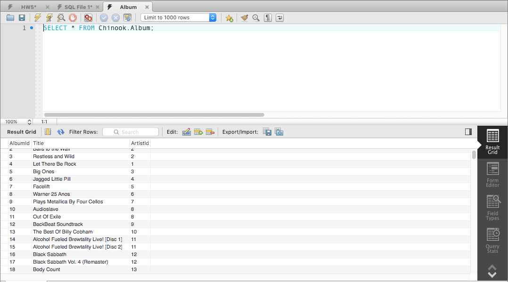

In other clients, it's easier to see the tables and their contents. In **SQL Pro**, select a database and click on a table to see many options:

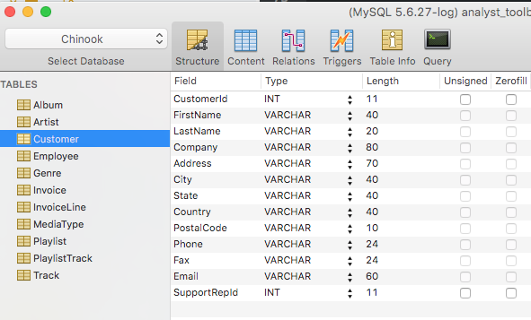

When you click on the "Content" icon on top, you will see the data table contents (a preview):

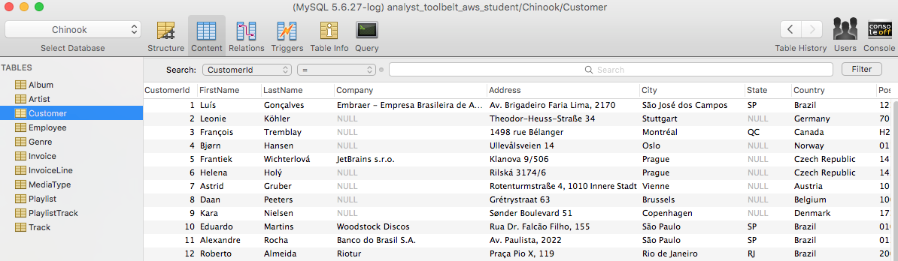

This is the same as doing a SQL query to show * from the table.

In HeidiSQL on Windows, the tab "donneees" shows the contents of the table:

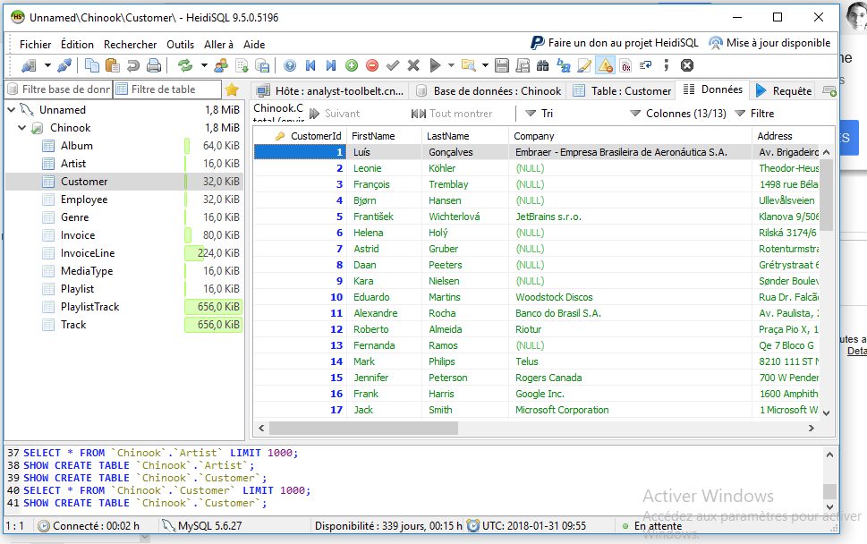

## Data Tables and Types

 In Chinook, there seem to be 2 sets of tables in this db - sales related items (employees, customers, invoices,
invoice_items) and musician items (albums, artists, genres, media_types, playlist_track, playlists, and tracks).

 Usually tables in SQL databases are related by keys to other tables.  This may or may not be an explicit "Foreign Key" relationship enforced across tables.  A Foreign Key is usually an id that is the same in 2 different tables, such as the CustomerID shown below in this one.  “CustomerId” here references Customer in another table.  This is similar to what you had in the VLOOKUP homework with the OrderID and returns.

Here is a view of SQL Pro and the Invoice table.  Notice one of the columns is the CustomerId.  What table do you think that relates to?  It should be obvious in a well-designed database.

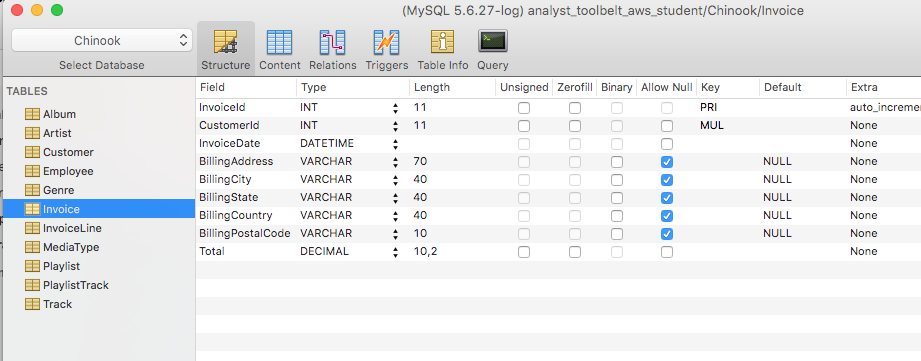

## Export to Excel

All SQL clients allow you to export the query results as CSV.  This is why we spend a lot of time on CSV import into Excel.

In SQL Pro, there is a small button at the bottom of the results page:

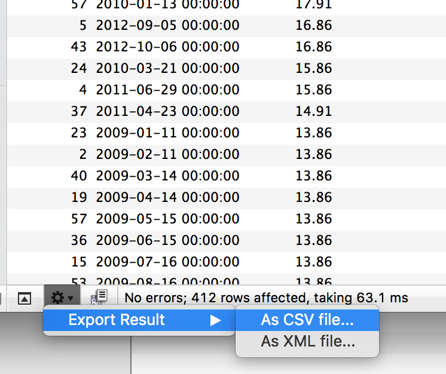

Export dialog options available in SQL Pro:

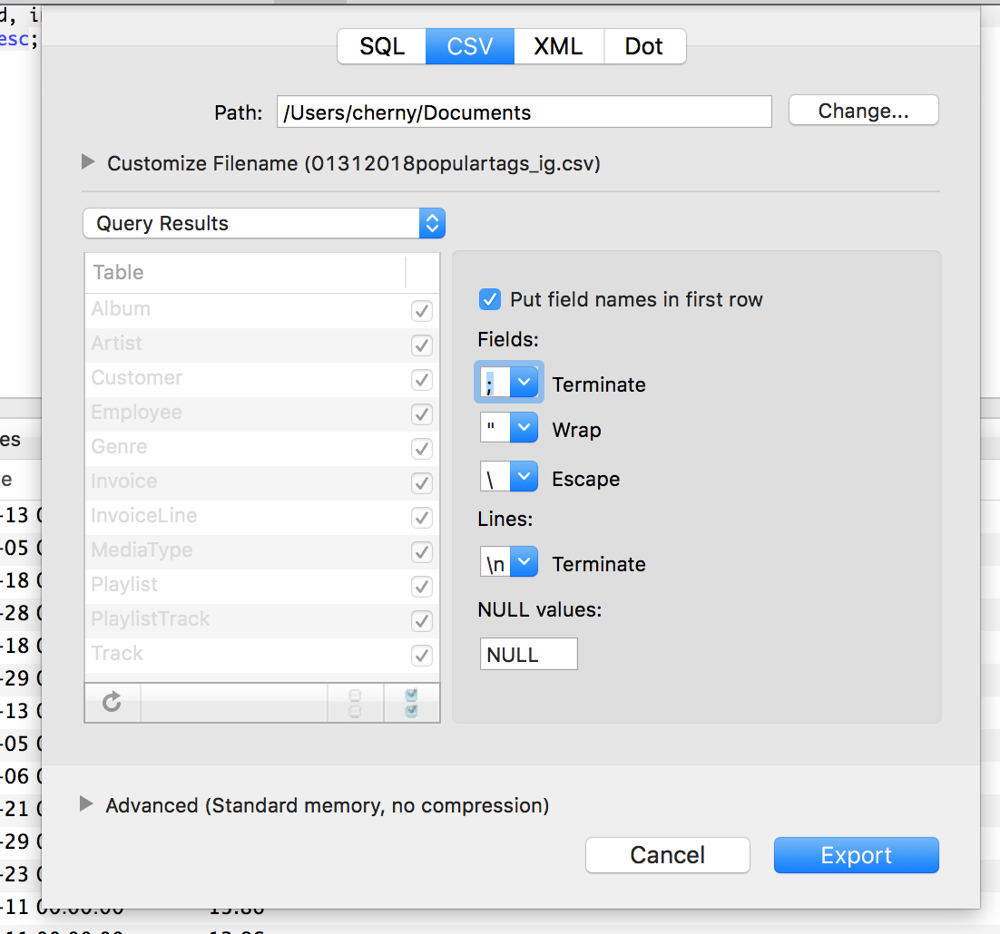

In Heidi SQL, you want to choose "Outils" menu, then "Export lignes de la grille":

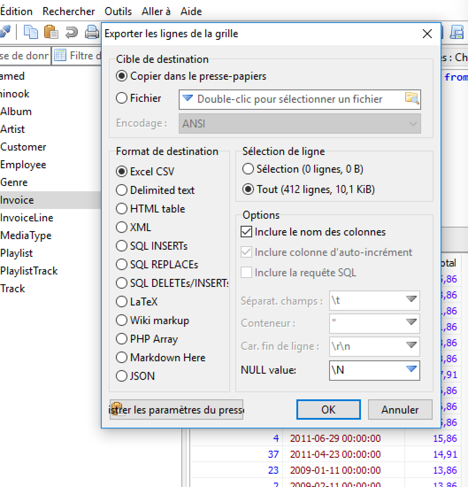

Then import the CSV data (or use Text-to-columns/convertir) and fix the column types:

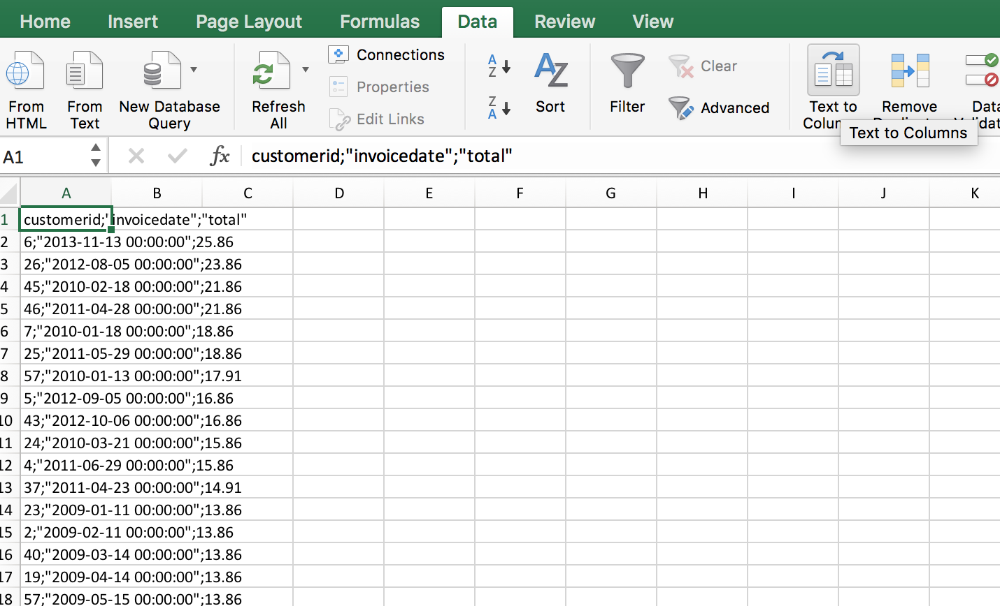

After importing into American settings and choosing "Currency" type for the Total, it appears this way:

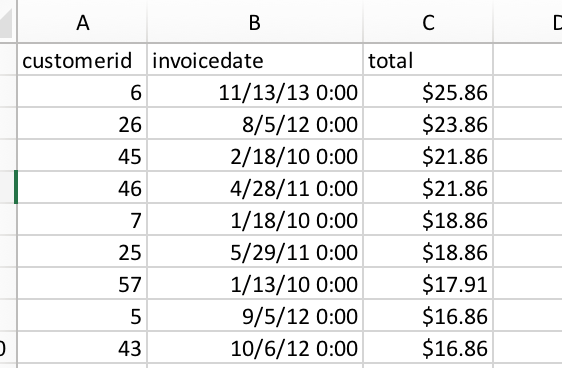

Importing into French settings, it appears this way (after you fix the currency to $):

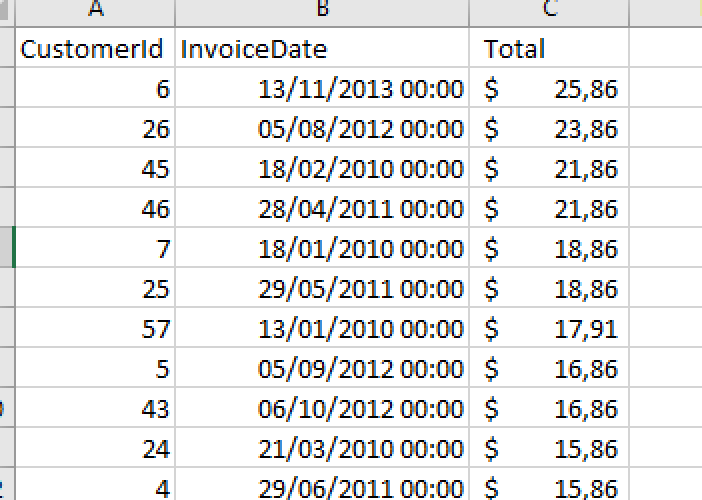

## Warning Re conversions

Data you export from these SQL tables will be in International
numeric format, not Euro/French. Your best bet is to use import
text file, and set your number format during the import wizard (the "convertir" dialog).

Also set the date format.  The currency may be the biggest problem, however.

If you have issues with your conversions, your fallback to fix the dates and numbers is to keep your columns in Text format, and use a formula to fix them in a new column:

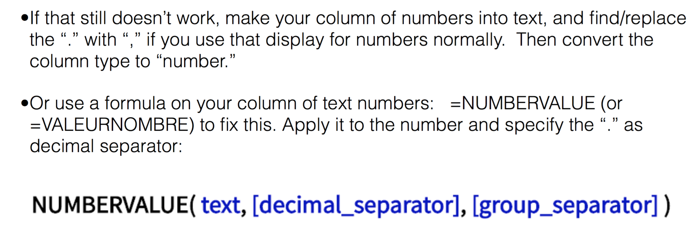

How do you know if you have issues?  If you can't do math with your column of Totals, for instance.  If your Pivot tables show errors like DIV0! (div by 0 problems).  That means your are probably still using "text" types for your numbers.
