## Week 5: More SQL

We are continuing SQL Bolt lessons: lesson 5-12 are needed for the homework.  Start: https://sqlbolt.com/lesson/select_queries_review

### Reminder that you can have multiple queries in a query window, and save them, in all clients.  In Heidi SQL:

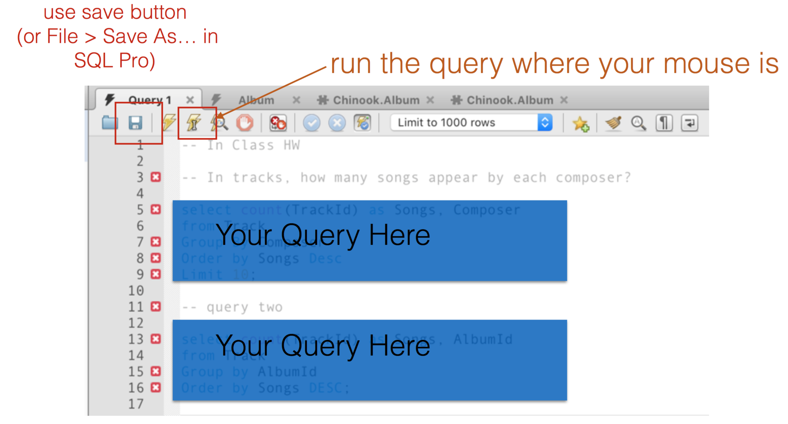

You must end your queries with a ";" to keep them separate and runnable in the same file.  Some of you missed this in the Homework.

You can find a "save" button for your query window, often under "File" menu.


### Aggregation in SQL

You can get the results you get from Pivot Tables in Excel, and more:

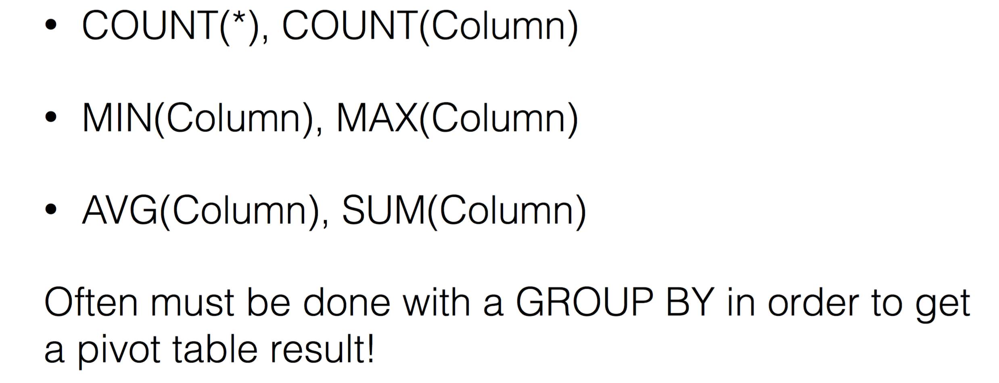

See [Select Queries with Aggregates Lesson](https://sqlbolt.com/lesson/select_queries_with_aggregates)


### Math in Queries

Remember you can do math in SQL queries:


Also in the WHERE query (to limit your results!).

Pivot Table in SQL

Done by select and math and groupby:

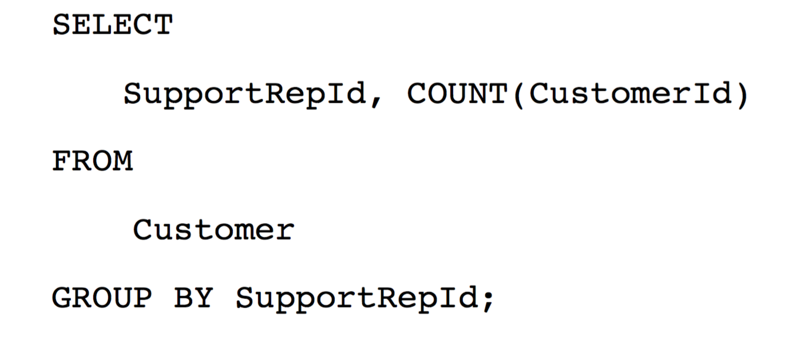

Whenever you do math, you need to think about grouping by the thing you are counting, or summing, or averaging...  Because you need to group before the calculation can occur.

How would you verify the result is correct?  You can take out the aggregation and do a pivot table in excel.

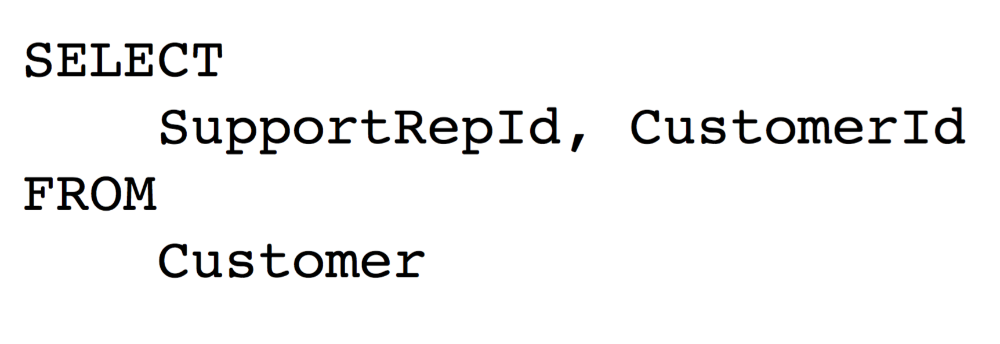

How would you get Total of Sales for this query?  and What are you totaling, exactly?

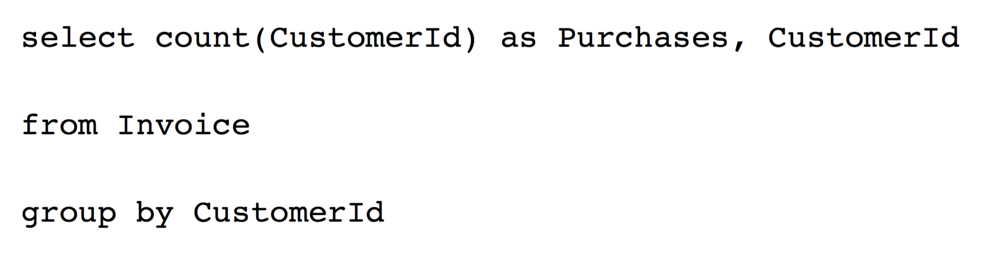

### Group By + "Having"


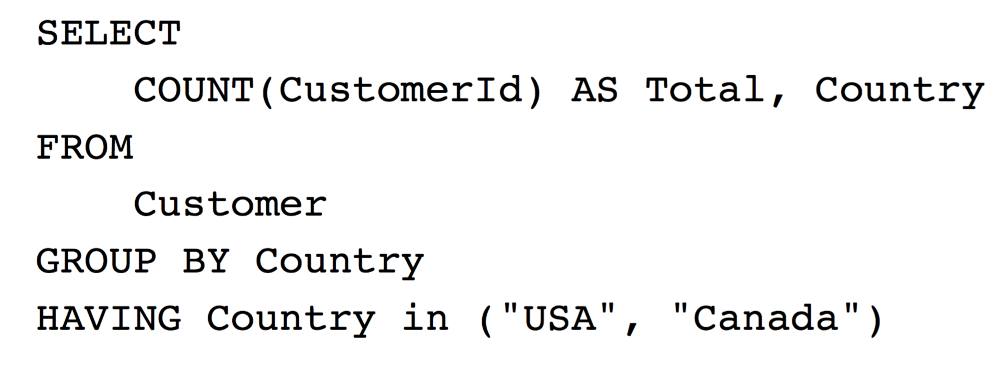

should be same result as the WHERE version:

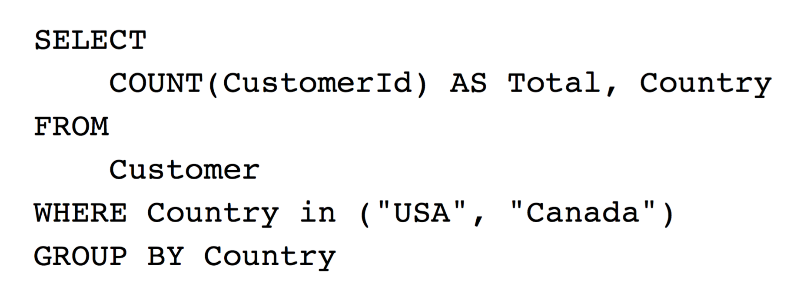

### Exercises

Save these queries to turn in!

In the Tracks table in Chinook, how many songs (tracks) appear by each composer?  Get the count of songs per composer, order by count descending (largest at the top) show only the top 10.

Find the number of songs per album.  Order by count descending.

### Advanced SQL -- Just FYI

Find the average of the song count per album.  This is complicated because it requires 2 queries in one. You can nest the first query INSIDE the second, giving it a temporary table name ("counts") and referring to it for your second query, the average.

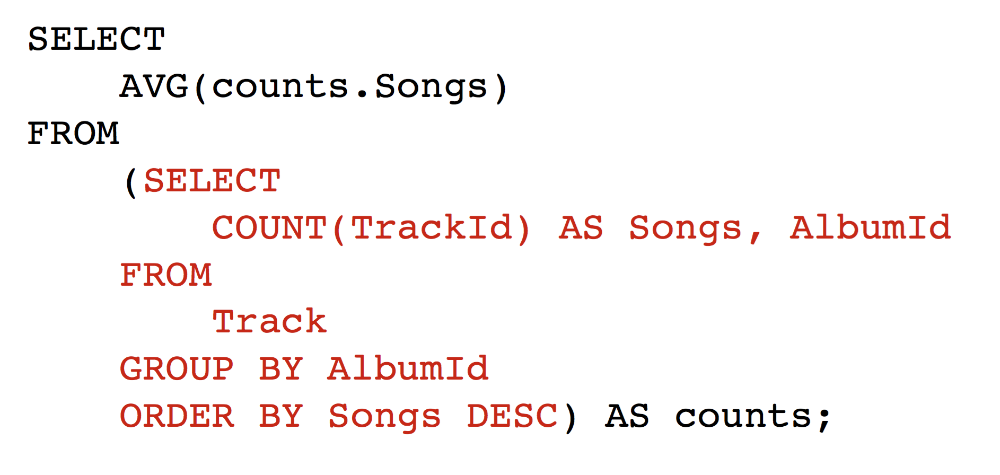

### Using a Join, Keys

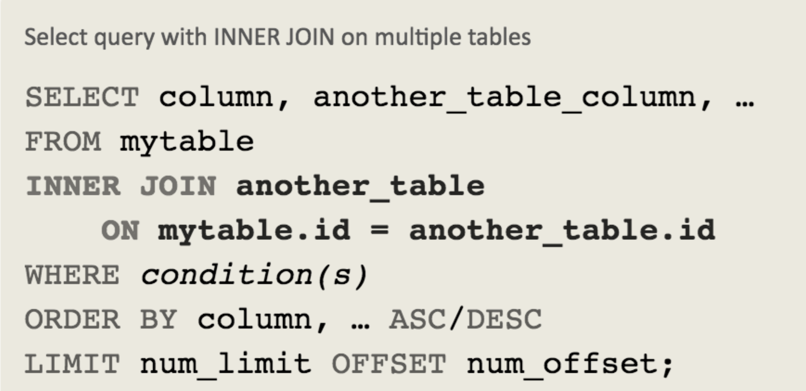

There is an ID that is shared across tables.  Sometimes it's actually defined as a "foreign key" and sometimes not explicit.  In a database diagram, it will look like this if it's an explicit constraint in the database. "PK" means primary key (the unique identifier for a row in a table), and "FK" means "Foreign Key," which links to another table's primary key. "Link" means it's the same value.

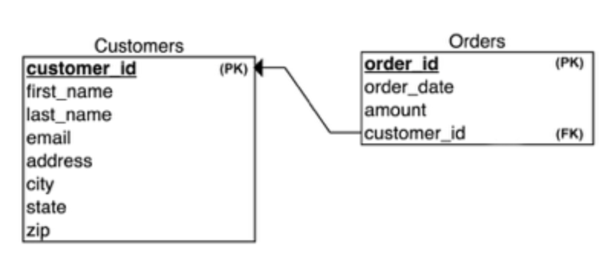

See http://www.sql-join.com/

Here is another database diagram for all of Chinook, showing the primary keys in each table with a key icon.  The links show the tables that are related by linked keys.

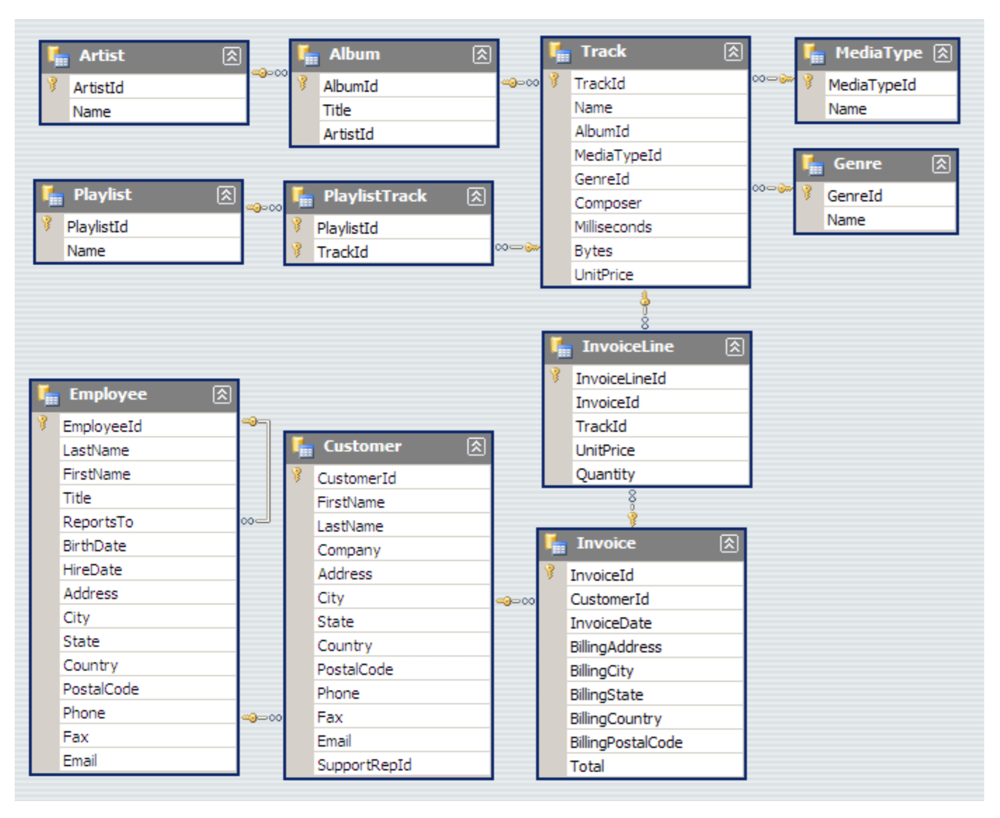

**LEFT/RIGHT JOIN**: Returns all rows from right or left side of the join, even if no match appears. (Much less common.)
More on Joins

**INNER JOIN** (most common): Only return rows
matching the condition in both tables.  Don't return other rows from one table that don't match!

**OUTER JOIN**: Return all rows from both tables even
if values in some row don’t match.

A visual aid in set terms:

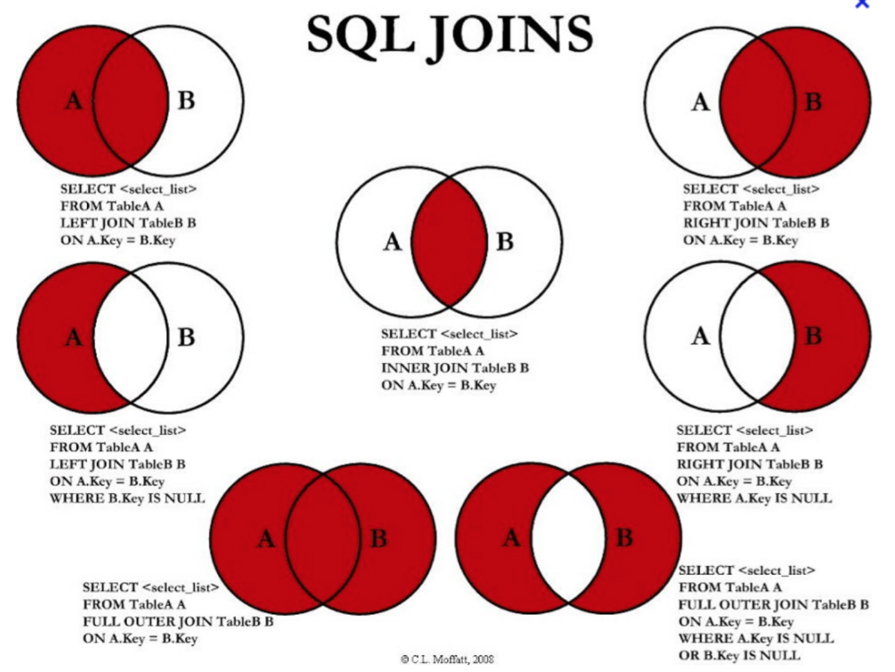

Example in Chinook:

````
SELECT Customer.LastName as Customer, Employee.LastName as Rep
FROM Customer INNER JOIN Employee
ON Customer.SupportRepId = Employee.EmployeeId;
````

This translates as "get me the last name of the customer, call it customer, and the lastname of the employee, called employee, from the customer and employee tables where the employee is the support rep for the customer."  In plainer English,  "I want the lastnames of the customers with their support reps!"

"[table].[column]" is how we refer to a column in a table in a query.  You need this because sometimes the same column exists in multiple tables (like when it's a foreign key).
You can use this syntax: “select [thing] as [name]” in order to label the output of thing with a friendlier name. Your columns will be nicer labels!

A join on Music:

````
SELECT
    PlaylistId, Track.TrackId, Track.Name
FROM
    PlaylistTrack INNER JOIN
    Track ON PlaylistTrack.TrackId = Track.TrackId
ORDER BY PlaylistId ASC;
````

### Duplicated Column Names : Must Specify the Table

This will produce an error.  Why?

````
SELECT
         Genre.GenreId, Name
FROM Track
             INNER JOIN
         Genre ON Genre.GenreId = Track.GenreId
````

You have to tell SQL which table you want the "Name" from.

````
SELECT
    Genre.GenreId, Track.Name
FROM Track
        INNER JOIN
    Genre ON Genre.GenreId = Track.GenreId
````

Complicated queries may require multiple joins!

Which support rep makes the most sales?

* This means, take all the invoices
* and find the customer id,
* and then their support rep id
* group by support rep id (or employee id)
* and total the sales.

This means 2 joins!  That's ok, though.


###  All the Clauses in a MySQL Query


See [Order of Execution lesson](https://sqlbolt.com/lesson/select_queries_order_of_execution)


### [Homework for the week.](Homework.md)

See [file](Homework.md). You will turn in queries in a text file (.txt) or .sql file.  These queries must be runnable by us and have comments identifying which HW question they are.

There is also a quiz on the concepts and the homework query results.
