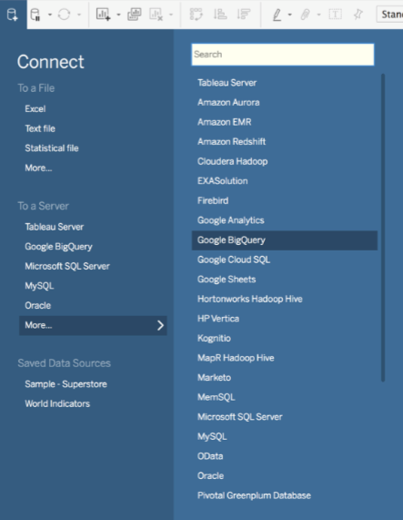

## BigQuery and Other Big Data Dbs


### Cloud databases

Databases as a service:

https://hackernoon.com/5-top-cloud-databases-that-works-wonders-7e628810e3ac


### BigQuery

and other Google options.


Quick Start Guide: https://cloud.google.com/bigquery/quickstart-web-ui

 Public Data available on BigQuery: https://cloud.google.com/bigquery/sample-tables

  an example application: http://chriswhong.github.io/nyctaxi/


To use BigQuery, you need an active Google developer account, probably tied to a credit card number.

Examples:

https://cloud.google.com/bigquery/public-data/hacker-news

Help with syntax https://cloud.google.com/bigquery/sql-reference/query-syntax

Almost exactly the same as MySQL now!

````
SELECT year, station_number, count(station_number) as Measures, avg(mean_temp) as MeanTemp
FROM [bigquery-public-data:samples.gsod]
WHERE year = 2010
GROUP BY year, station_number LIMIT 1000
````

````
SELECT
MIN(MeanTemp) AS Min, MAX(MeanTemp) AS Max
FROM (
SELECT year,
STRING(station_number) AS Station, COUNT(station_number) AS Measures, AVG(mean_temp) AS MeanTemp
FROM [bigquery-public-data:samples.gsod]
WHERE
year = 2010
GROUP BY year,
Station LIMIT
1000)
````

## Amazon Big Data Services

[Big Data Tools Overview](https://aws.amazon.com/big-data/)

[Public Datasets on AWS](https://aws.amazon.com/public-datasets/)

"users pay only for the compute and storage they use for their own applications."

[Types of Databases](https://aws.amazon.com/products/databases/) they offer


# Tableau Connections Available...


