# Tableau Training

### Required for the Homework

http://www.tableau.com/fr-fr/learn/training

Use this data: http://www.tableau.com/sites/default/files/getting-started_data-sets_fr-fr.zip

Watch “Demarrage” and “L’Interface de Tableau.”  
For HW, you will recreate the charts in the “Demarrage” video.

https://www.tableau.com/fr-fr/learn/tutorials/on-demand/getting-started?reg-delay=6c7a19ee163152f99a781d669f828213

### In Class

Connect a datasource and choose "Excel."  Use Superstore.xlsx.

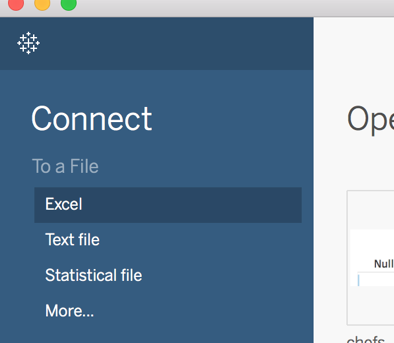

Drag the data sheet you want into the upper area.  Pick "Orders."

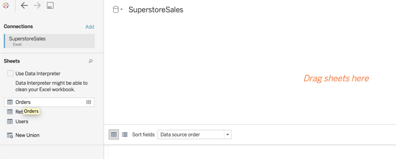

Joins:  Drag "returns" up there too.

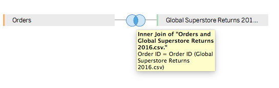

You get an inner join by default.
Click on the join icon and change it to a Left Join.
What is the difference?

As soon as you have data visible, you can make a visualization sheet. Lower left corner:

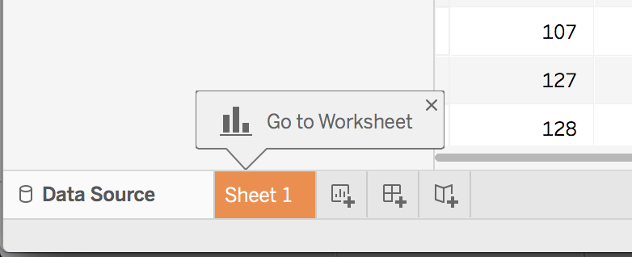

#### Dimensions and Measures

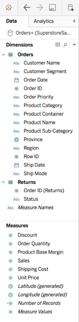

Categories, on upper left, are Text items, often discreet, ways to split your data numbers.

Measures, on the bottom left, are generally numbers.  Quantitative.

Read: http://www.datablick.com/blog/2017/2/24/tableau-padawan-data-types-vs-display-formats

In the upper right corner, click on "Show Me."  Click on a dimension or measure and watch it change.  It shows charts that may work with that kind of data.

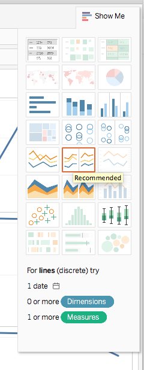

Command-Click (on mac)
or CRTL-click on multiple
measures and/or dimensions to
see what is suggested for these variables.  Combined data elements are more interesting to chart.

Link: https://onlinehelp.tableau.com/current/pro/desktop/en-us/buildauto_showme.html

For example, click on these to see this:

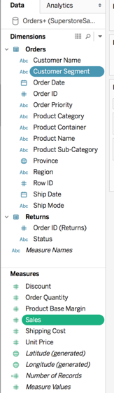   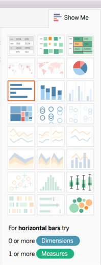

If you click on the bar chart in Show Me, you will get:

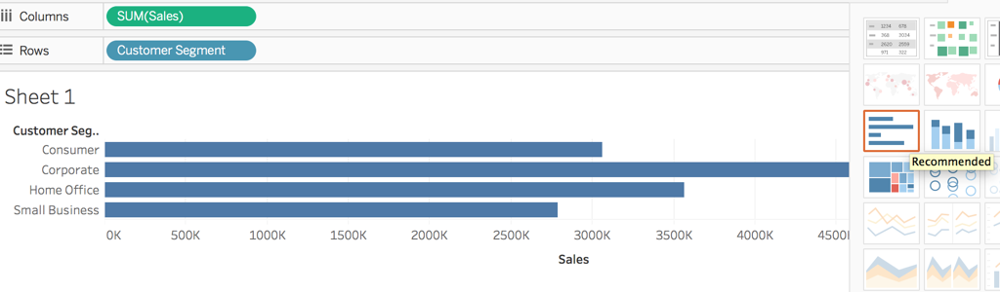

Just like in a pivot table, you can change your aggregation method for the bars:

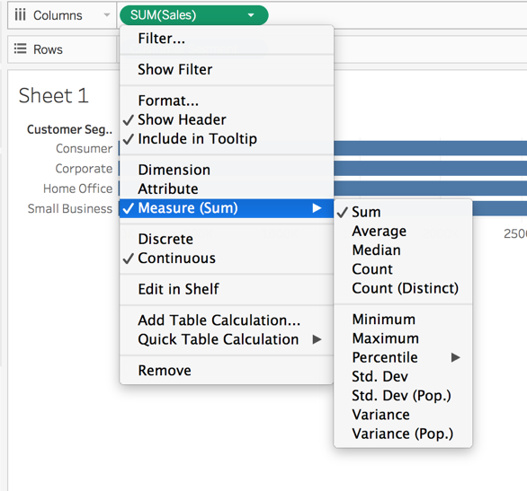

You can stack up rows and columns in your chart, using Drag and Drop. Start from Province and Product Category and then drag the others in:

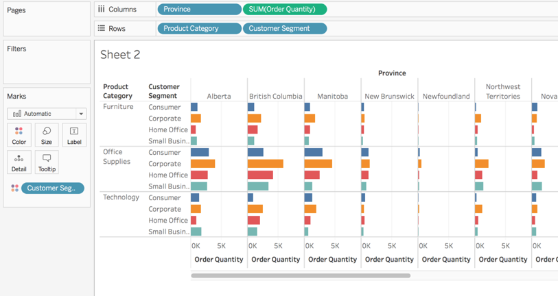

Timeseries are easy:

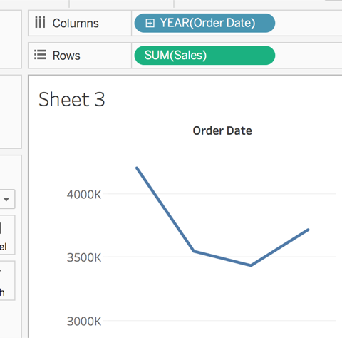

Use the + in the Years Pill to get breakdowns:

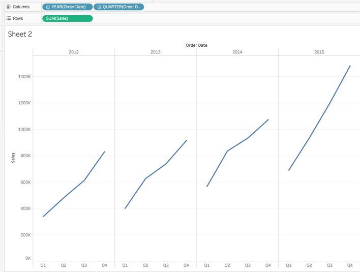

Keep clicking the + to expand:

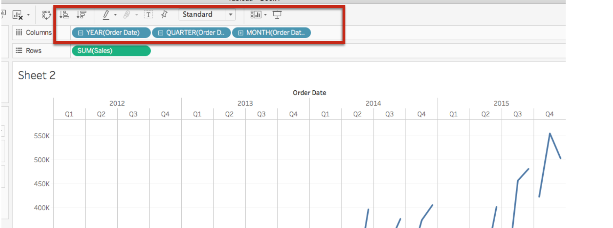

Now try dragging Product Category into a Row.  It will re-order for you:

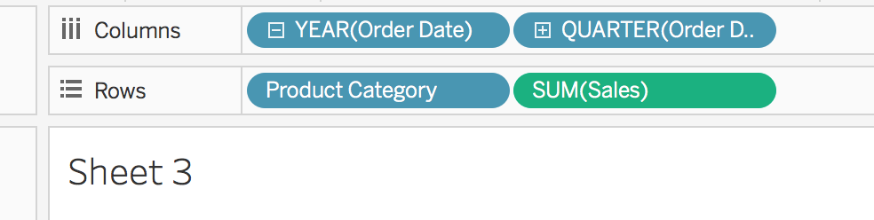

Now drag Product Category onto COLOR in the marks menu.

Use Show Me to put them all on the same axes (the one on the left):

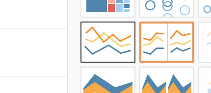

Then change "Sum" to "Avg(sales)" in your rows:

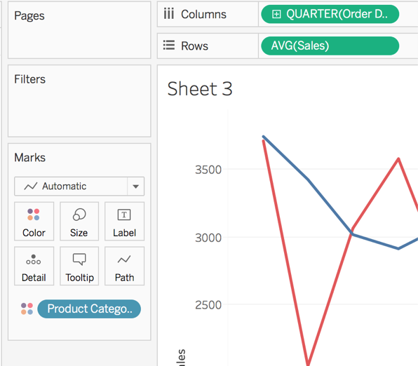

You can customize the info tooltip ("infoboule") to add items, like Sum of Sales.

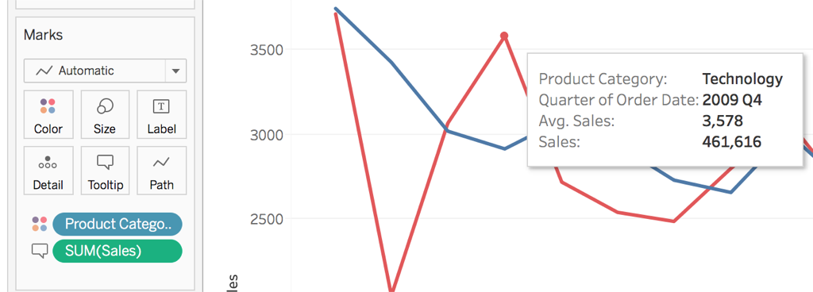

### Histograms

Make a histogram of count of sales.  Click on sales and Show me:

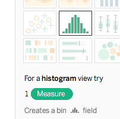

Gets you:

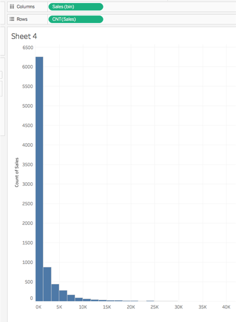

Right click on the x axis, select "edit axis", and change the limits.

Edit the bins for the histogram using the created Dimension item:

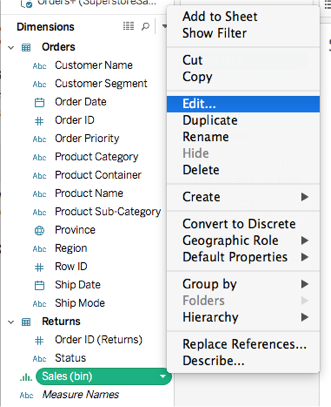

### Adding Annotations

Change to sum(sales) in your Row now:

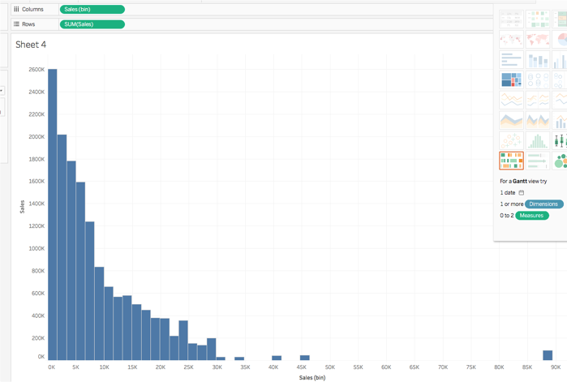

Add an Annotation for the Average to your chart -- drag it:

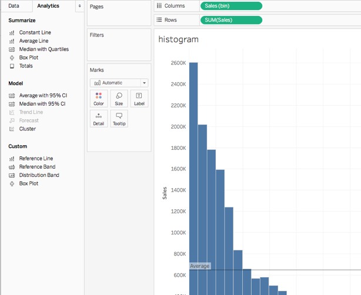

### Inspect the Data

Right click on a bar, and click "view data":

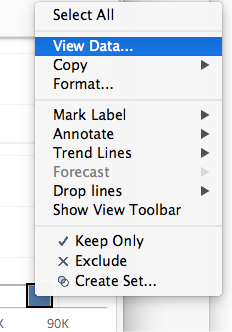

The binned data will show the current bins, but you have a tab on bottom for "full datat":

### Heatmap in tableau

Use this on in Show Me:

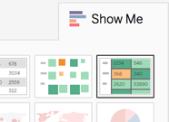

To get:

Add a Highlight/Sousligner to it:

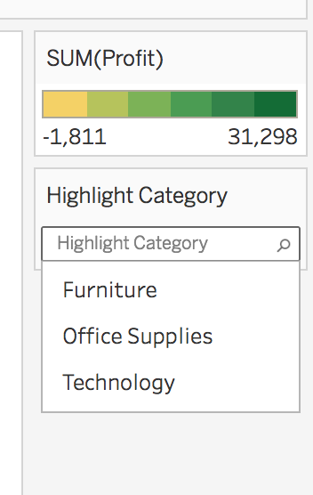

Change the color palette by clicking on Color, Edit Colors...

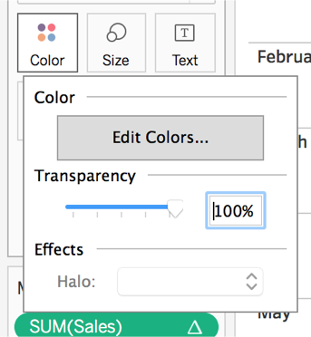

### Maps

Control-click on two items, one a measure (quantitative) and one geographical. In Show Me, pick one of two maps:

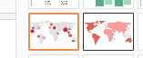

The one with the shaded countries (NOT the dots) is called a "Choropleth map."

Maps sometimes need location help in Tableau. If nothing appears, or if only some items appear,
you have to "Edit the Locations" to help Tableau identity them.  Click the small gray bullet in the lower right corner if it's visible.

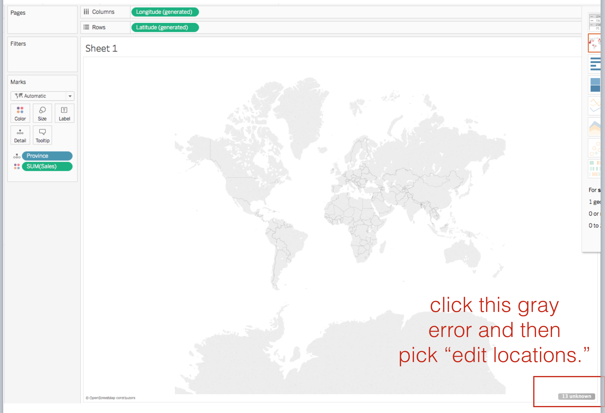

The country should be "Canada."

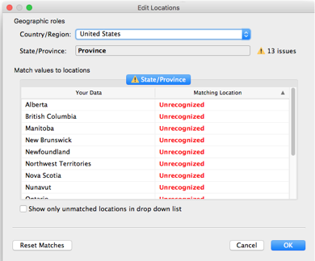

Fix Saskatchewan spelling by hand:

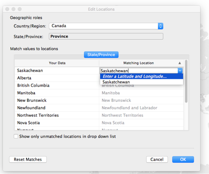

This shaded map is a "choropleth map."

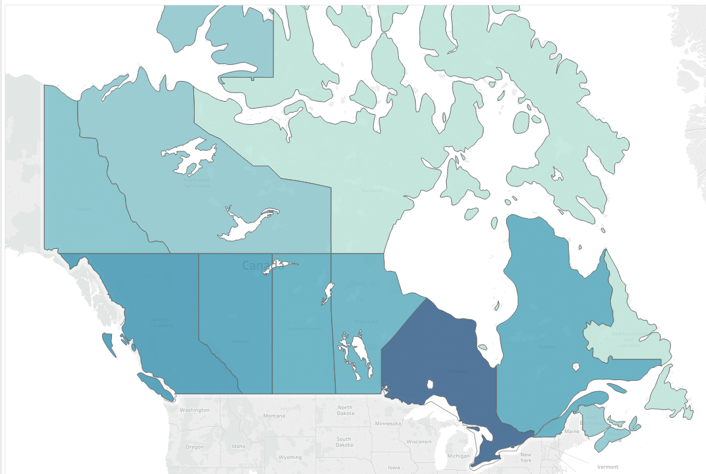

The other type of map uses symbols (circles) sized relative to the amount of the quantity and placed at the location.  This works best for City or other local data. You will make something like this in the Getting Started Video, but I have added transparency to make it look better:

### Hierarchies in dimensions

You can drag items under other items to create nested hierarchy.

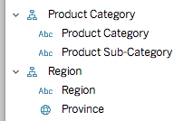

Just like dates, hierarchies allow you to "drill down" into category levels:

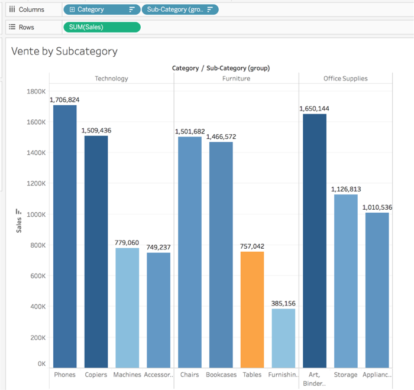

### Scatterplots

There are a couple methods to make scatterplots in Tableau.  One is to just show all your marks, un-aggregated.  The default is for Tableau to aggregate and you will see only a single dot:

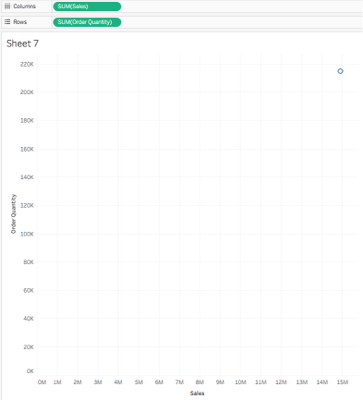

This is a hidden control on a menu:

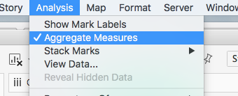

Now you can see all your dots:
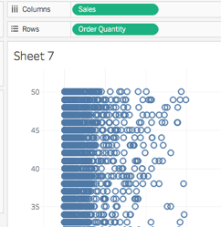

You could add a trendline from the Analytics tab:

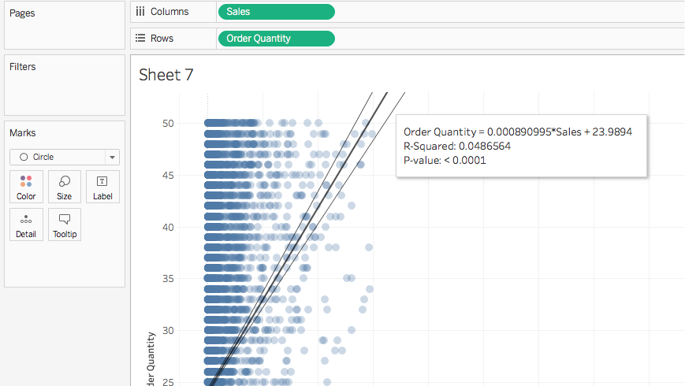

To deal with the overlap of dots, the best solution is to use transparency.  Do it in the Color marks menu:

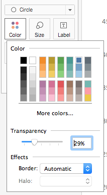

You'll have colored trendlines if you break out your marks by a dimension like category or segment:

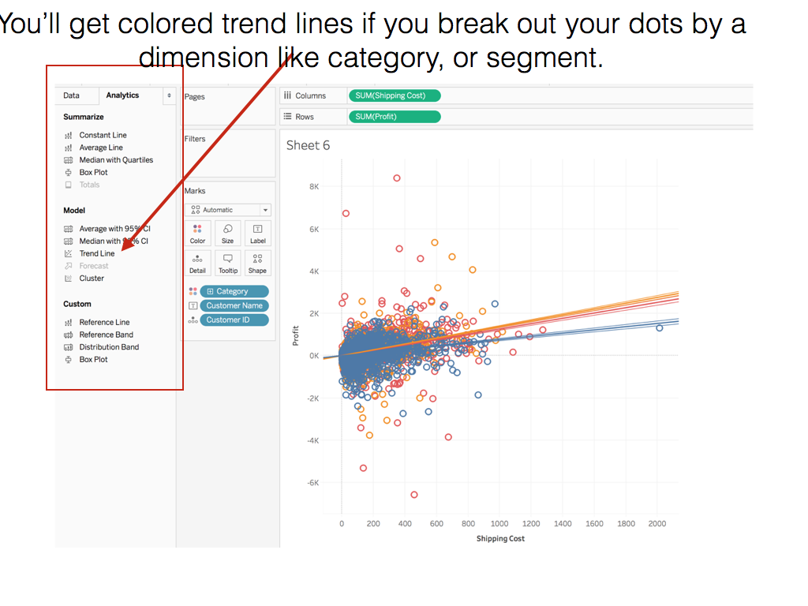

Another option for a Scatterplot is to use aggregration on the dots, using the "detail" menu item.  Here I've set the Category to both Color and Detail, which makes for 3 SUM aggregated dots:

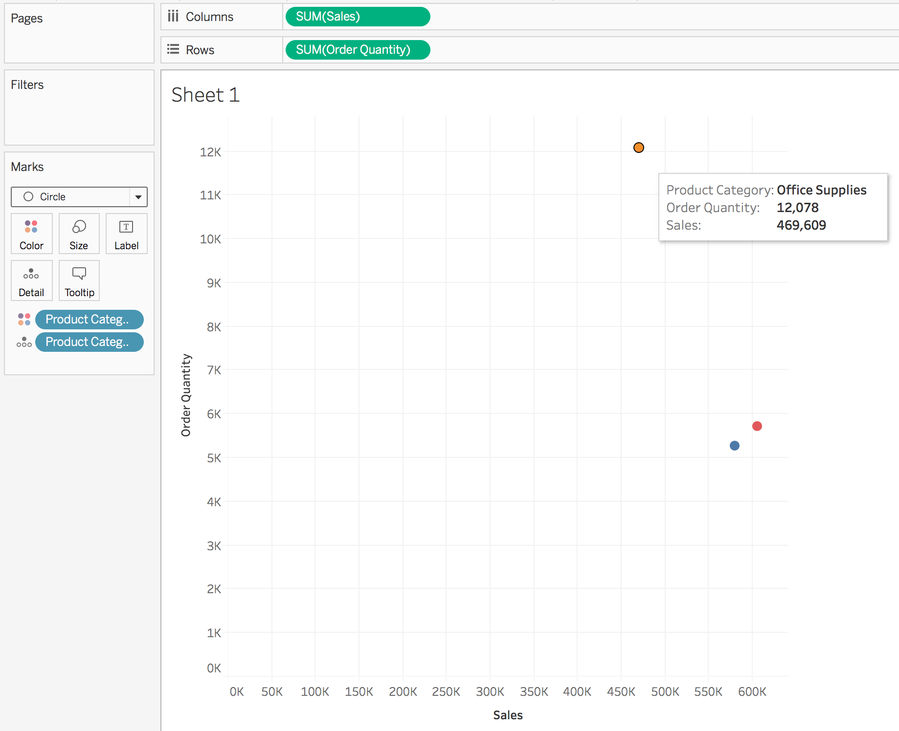

### Dashboards

Dashboards are created using existing Sheets in your workbook. You must have created the views you want to add to you Dashboard in advance.  You will see them in the Getting Started video.  There is a "Live Filter" in this one.

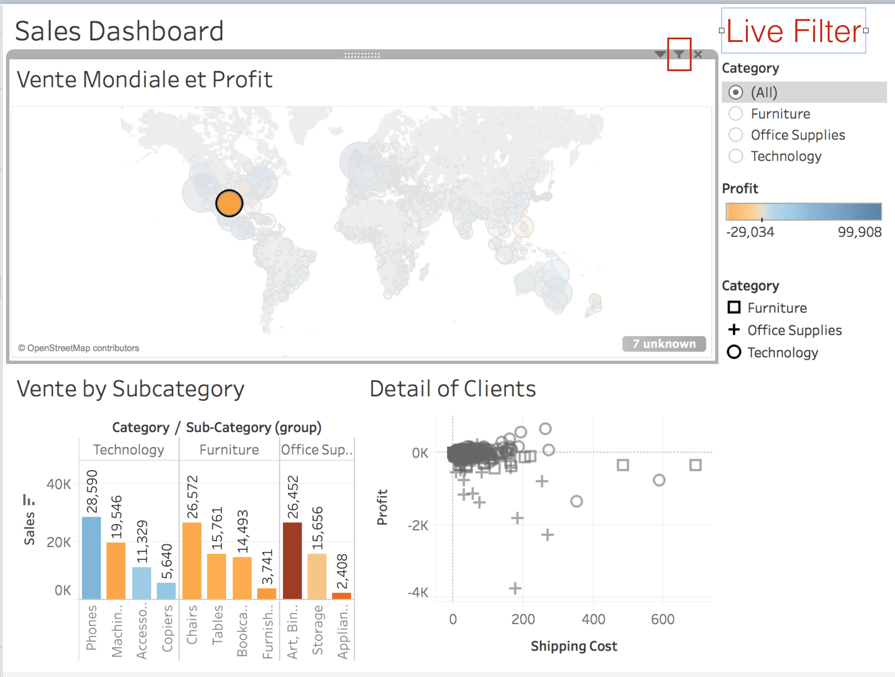

### Save as PDF

You can save the whole workbook as PDF for the Homework. It will not look good, but that's ok for the review.

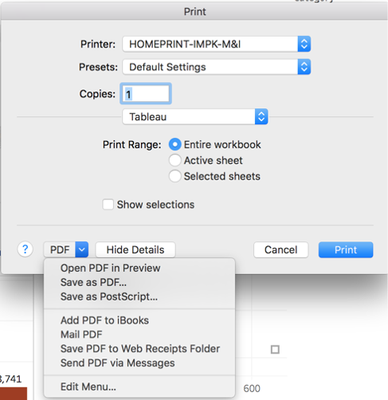

### Save a Single Chart Image

Right click on the background of a sheet, select "Copy," then Image...

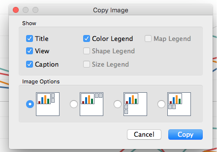

Then you can paste into a PPT or email for a client.

### Required for the Homework

http://www.tableau.com/fr-fr/learn/training

Use this data: http://www.tableau.com/sites/default/files/getting-started_data-sets_fr-fr.zip

Watch “Demarrage” and “L’Interface de Tableau.”  
For HW, you will recreate the charts in the “Demarrage” video.

https://www.tableau.com/fr-fr/learn/tutorials/on-demand/getting-started?reg-delay=6c7a19ee163152f99a781d669f828213
