# Advanced Work with Tableau

Tableau needs LONG data (unpivoted).

Remember how we unpivoted data?  You need it to be long data, not summarized by columns.
Paris Rainfall unpivoted: Load that into Tableau.

Make this:


### Adding Annotations on Outliers

Make this a habit. It is good design.

Right click on the dot:

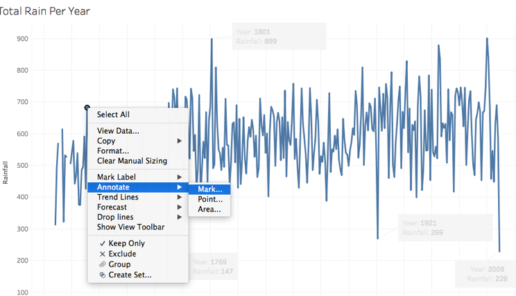

## Exploratory Charts - Examine Your Data

Always do counts on your data, using histograms and/or boxplots to see distributions.

 

 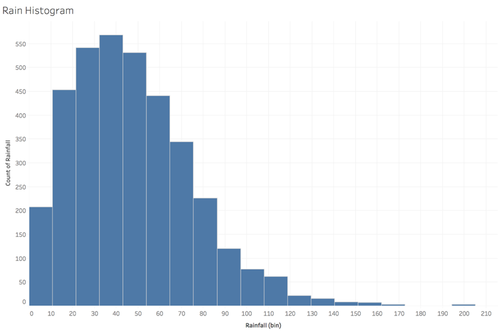

 Make this:

 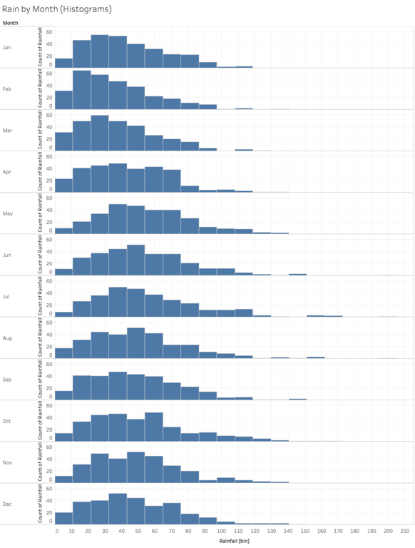

 What about this:

 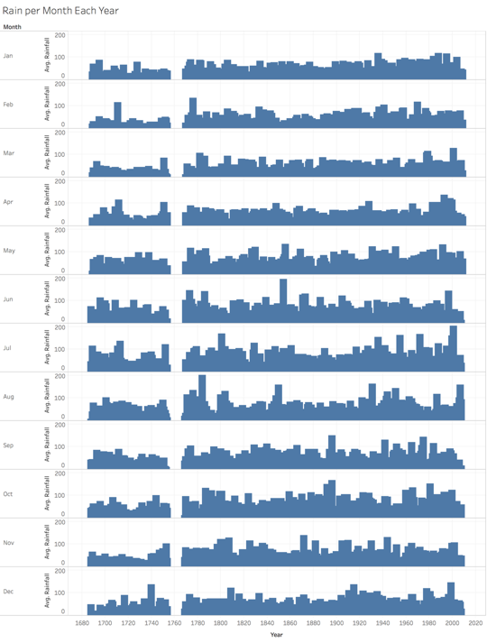

 ## Boxplots

 You need to uncheck "Aggregate Measures" again.

 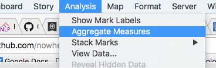

 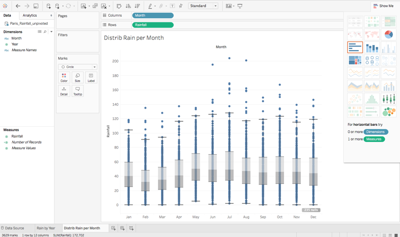

 ### Calculated Fields

 Right-click on the background of "Dimensions" on the left to create a Calculated Field.  Enter this:

 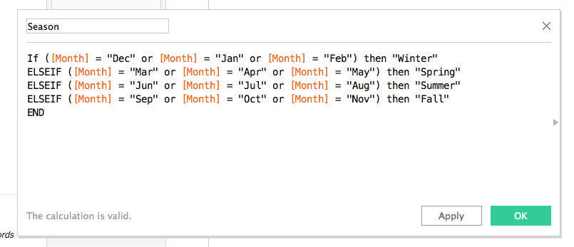

 [See the Help Docs link on calculated fields](http://kb.tableau.com/articles/knowledgebase/creating-groups-using-calculated-fields)

You can also copy-paste this:

````
If ([Month] = "Dec" or [Month] = "Jan" or [Month] = "Feb") then "Winter"
ELSEIF ([Month] = "Mar" or [Month] = "Apr" or [Month] = "May") then "Spring"
ELSEIF ([Month] = "Jun" or [Month] = "Jul" or [Month] = "Aug") then "Summer"
ELSEIF ([Month] = "Sep" or [Month] = "Oct" or [Month] = "Nov") then "Fall"
END
````

Then you can use it like other dimensions!

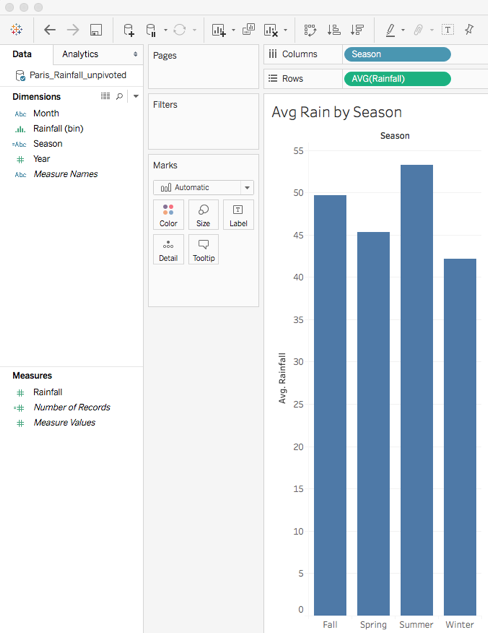

Seasonal Trends using this:

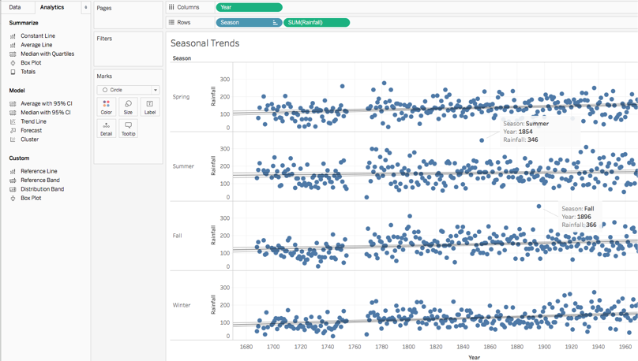

You should be able to drag the reorder the seasons.


### Worksheet Setup


### Another Map

Try the Wisconsin Shootings Excel file now.

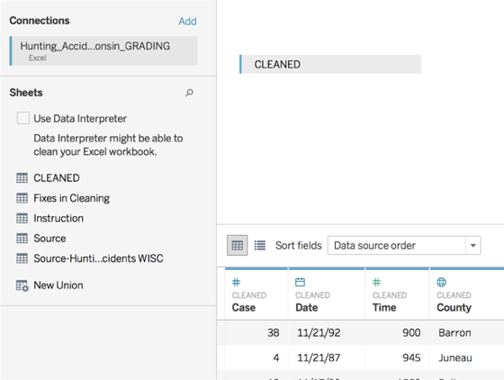

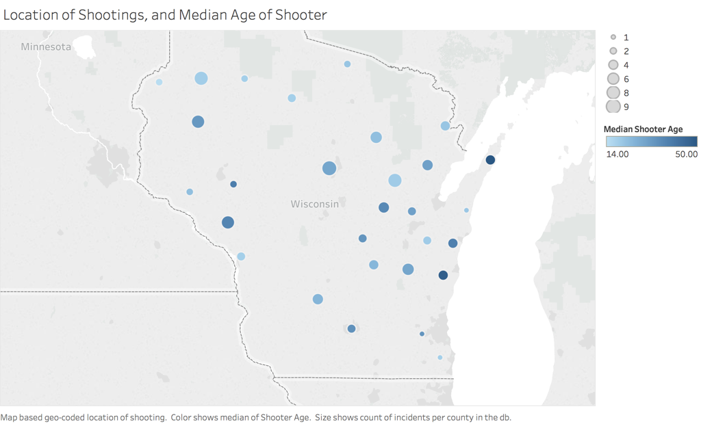

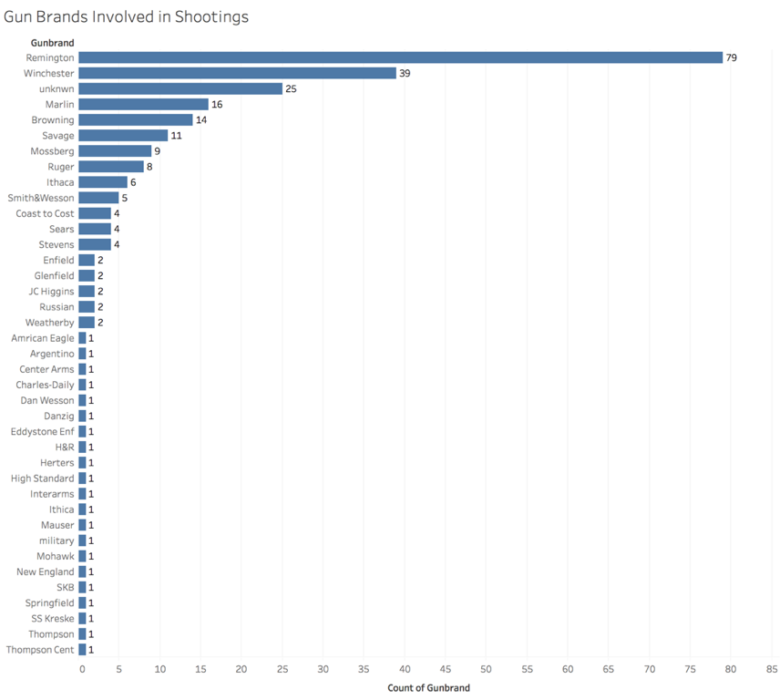

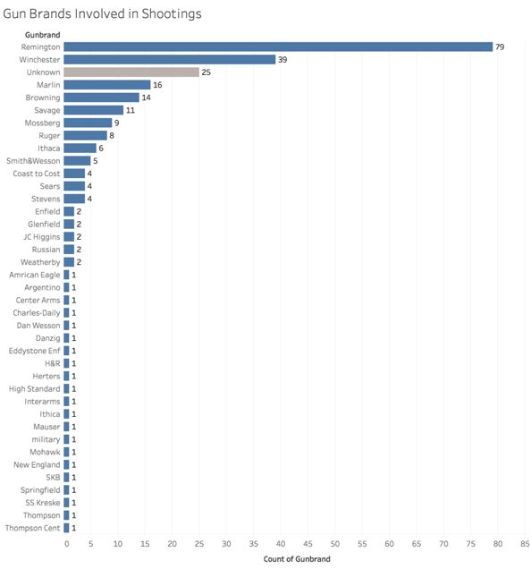

Edit the Alias:

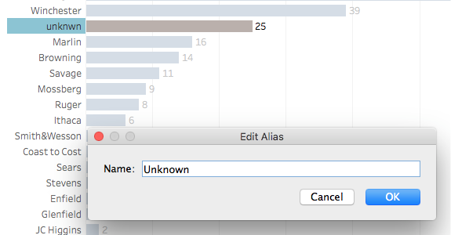

Group:

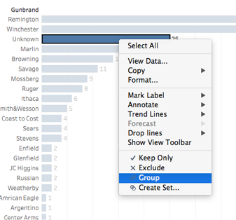

Then fix colors:

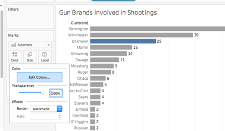

Cases by year:

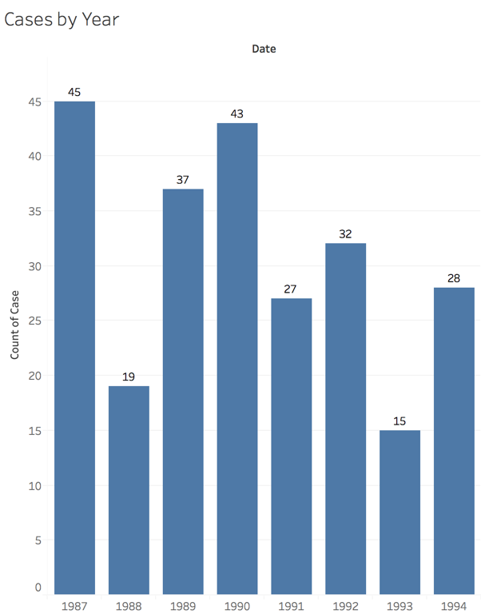

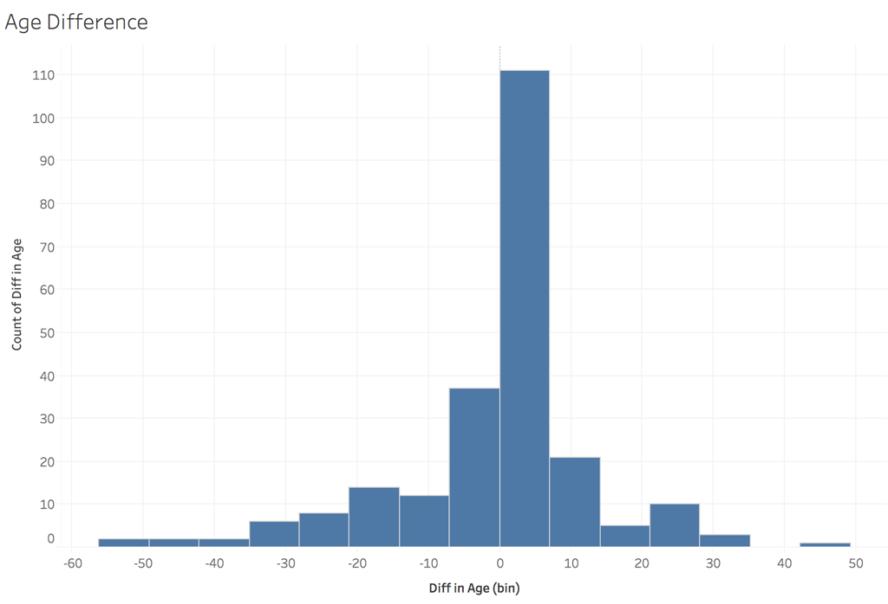


### Filtering

Right click on "Unknown" and exclude it for now:

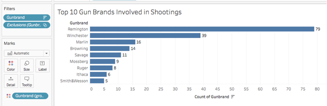

Then make a filter for top 10.  Drag an item into "filters".

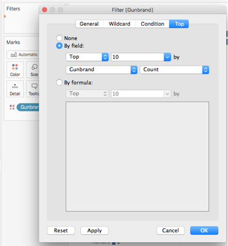

### Labeling Things Properly

Good visualization design also means good text use.

* Changing your Axis labels or making aliases for data point labels for clarity
* Making a good title for the chart
* Adding text annotations and explanations


### Reminder: Copy Image to save it

For reporting with Tableau, use the Copy > Image option
and paste into your PPT/Word doc.
(You saw how bad the PDF export is.)

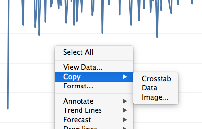
