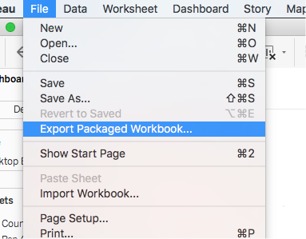

# Final Projects

Turn in 2 files. A packaged Tableau Workbook and a PDF document as described below.

## High Level Requirements

Use SQL to explore your data files. You can use SQL to extract data, then analyze in Tableau or in Excel and then import to Tableau for charts.

* Produce and submit a Tableau Workbook exploring and summarizing the data in an interesting way. Details here:

    - Make Storypoint charts in Tableau, walking us through the data story you found with your data.  Normally you would present this to the class, but we don't have time this semester. It must stand on its own as a data story I can follow and learn from.
    - You must have at least 10 charts that explore and summarize the data.  These should be well chosen — and relate to the “big picture” and to each other. It must be something you would present to a client — standalone, clear, clean, well- labeled and explained without requiring you to verbally interpret.  It must look good and professional.
    - Avoid the design errors I described last week in the chart tips discussion.

* Submit a PDF of your charts from the workbook and explanation of how you did them
    - Use copy image or screenshots of the charts.
    - Also, in the PDF, include explanation of what you did to get your results: data sources used, table sources, transformations you did in SQL or Excel, SQL queries, any calculations, assumptions, cleaning and outlier removal, etc.

Be sure to turn in a Packaged Tableau Workbook (which includes data links-see https://onlinehelp.tableau.com/current/pro/desktop/en-us/save_savework_packagedworkbooks.html).  Along with your PDF document.

## Grading breakdowns

The Final Project is 25% of your grade for the course.  NO COPYING OR WORKING TOGETHER. THIS IS INDIVIDUAL WORK.

Breakdown of the points:
* Good data story (overview, exploring related interesting facts): 15%
* Charts are labeled on axes, captions if needed, titled, and clear to reader: 15%
* Annotations/marks on outliers and notes to make it clear & interesting and understandable: 10%
* Good data analysis and charts from given data (i.e., not bad stats, or bad charts, see tips document from last week): 15%
* Use of multiple excel/sql tables, queries, extracts, transforms, calculations as required (documented in the Appendix and clear from the workbook you submit): 20%
* Explanation in PDF doc is clear: source of data & what you did to get the results: 15%
* Following these directions: 10%. Should be easy. If you don't follow directions you also lose the points for the thing(s) you didn't do.

You must all turn in original work. You can ask each other for help, but you may not use each other’s results. I expect workbooks and charts to be original.

## datasets

I will assign datasets from the SQL database to people in the class. It will be done tomorrow or on the weekend.

My office hours will be by arrangement, feel free to ask me for time?
