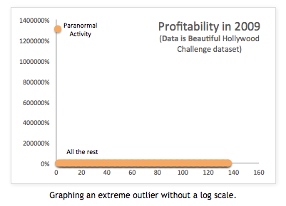
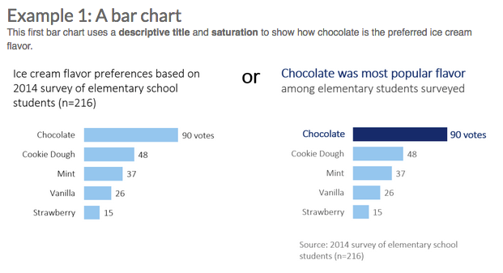

# Storytelling with Data


## Data storytelling

* [Forbes article](https://www.forbes.com/sites/brentdykes/2016/03/31/data-storytelling-the-essential-data-science-skill-everyone-needs/#1264193f52ad)

````
Google’s Chief Economist Dr. Hal R.Varian stated,
"The ability to take data—to be able to understand
it, to process it, to extract value from it,
to visualize it, to communicate it—that’s going to be a
hugely important skill in the next decades.
````
See [this success story aquisition -- I used to work there](https://www.forbes.com/forbes/welcome/?toURL=https://www.forbes.com/sites/antoinegara/2018/03/06/wall-street-tech-spree-with-kensho-acquisition-sp-global-makes-largest-a-i-deal-in-history/&refURL=https://t.co/DBkR6eoA33&referrer=https://t.co/DBkR6eoA33#11bd255e67b8), which is really about databases and vis.

Forbes again:
````
Many of the heavily-recruited individuals with advanced
degrees in economics, mathematics, or statistics struggle
with communicating their insights to others effectively—
essentially, telling the story of their numbers.
````


## Data Journalism

Stepping thru a data story:

* http://fivethirtyeight.com/features/gun-deaths/

* http://www.nytimes.com/interactive/2014/03/31/science/motorcycle-helmet-laws.html

* The "Stepper" is just like Tableau's text buttons in a story: http://www.nytimes.com/interactive/2013/02/04/science/girls-lead-in-science-exam-but-not-in-the-united-states.html

* Academic article reviewing techniques in data stories: http://vis.stanford.edu/files/2010-Narrative-InfoVis.pdf


## Data Exploration for your in-class and project work:

look for

* Outliers - values very different from the rest
* Groups (by continent, year, etc)
* Trends over time
* Top N (10, 20…)
* Calculate Differences (gain - loss, etc)

If you find something interesting, then look into WHY. (Dive deeper.)

### Outliers: How to "Use" Them In a Story


If you have multiple outliers, what makes them similar or surprising?


Read [Nathan Yau's advice](http://flowingdata.com/2018/03/07/visualizing-outliers/) on visualizing and working with outliers.

````
In one case, the outlier is noise relative to the rest of the data.
In another the outliers deserve a closer look.
````

See my post here: [Data Characters in Search of An Author](http://blogger.ghostweather.com/2014/05/data-characters-in-search-of-author.html)




### Groups - Can You Find or Make Them?

Coloring countries by a few categories so you can compare the groups:


Sometimes the data reveal a pattern you can then "explain" or work with further:


### Calculate Differences


### Ask Yourself, like a Journalist:

* Who, what, when, why, where…
* Summarize all the data (histograms too)
* Are there any surprises?
* If so, what if you dive into that group/category/time period deeper.

## Reminders for your story

State your points in the charts. Make it easier for the viewer. Annotations, subtitles, finding of the chart, key labels, your authority/credentials for the chart's contents.

From Ann K Emery [4 Storytelling Strategies](https://annkemery.com/four-storytelling-strategies/)




See also Jorge Camoes [book Data At Work](https://www.amazon.com/Data-Work-practices-effective-information-ebook/dp/B01DYIPZF4/ref=sr_1_1?ie=UTF8&qid=1520500098&sr=8-1&keywords=jorge+camoes).

## Hans Rosling

The most famous example of storytelling: [Hans Rosling's video](https://www.ted.com/talks/hans_rosling_shows_the_best_stats_you_ve_ever_seen?language=en)

He relies on
* animation
* and narration
* and pointing at parts of the graph.  Especially outliers.

What if you have static (not animated) charts?  What points would you show?
Let’s try it…  When you watch it, I want you to take notes on the "main points" he makes.  What are the story points if you made it as a static story?

This is an in-class exercise to turn in. (Put your name on your paper legibly.)

## Story-telling in Tableau

* Introducing it: https://eagereyes.org/blog/2013/story-points

* An academic paper on the topic: http://kosara.net/papers/2013/Kosara_Computer_2013.pdf


## Links on Using Tableau Storypoints

* [Ins and Outs of Stories](https://tc14.tableau.com/schedule/content/961)
* [Help docs on story points](http://onlinehelp.tableau.com/current/pro/desktop/en-us/help.htm#qs_stories.html)
* [Help on sharing stories](http://onlinehelp.tableau.com/current/pro/desktop/en-us/help.htm#stories.html%3FTocPath%3DPublish%2520and%2520Share%7CStories%7C_____0)
* [The Earthquake Workbook](https://public.tableau.com/profile/tableau.docs.team#!/vizhome/EarthquakeTrendStoryExample/Earthquakestory) - we'll go thru this
* [Earthquake story walkthru](http://onlinehelp.tableau.com/current/pro/desktop/en-us/help.htm#story_example.html) - you should read this.


## Dashboards

Moving from Stories to Dashboards.  Or, how do they relate?

[Storytelling in Dashboards bu Susie Lu](http://www.susielu.com/data-viz/storytelling-in-dashboards)

Book rec, [Big Book of Dashboards](http://bigbookofdashboards.com/).

##  Jobs and companies

A few french companies of interest:

* WeDoData, see [http://www.storybench.org/how-wedodata-data-visualization-studio-bridging-narrative-statistics/](http://www.storybench.org/how-wedodata-data-visualization-studio-bridging-narrative-statistics/)
* [Dataveyes](http://dataveyes.com/#!/fr)
* [Toucan Toco](https://toucantoco.com/fr/) - hiring my students who can do data vis and storytelling and can understand SQL without help.
