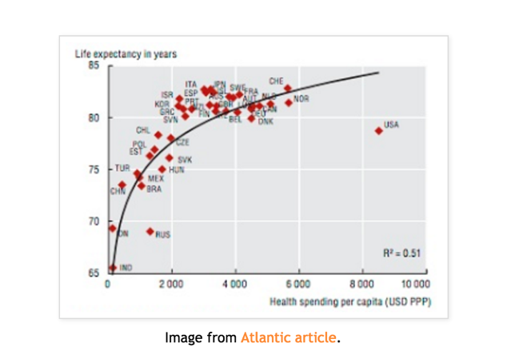
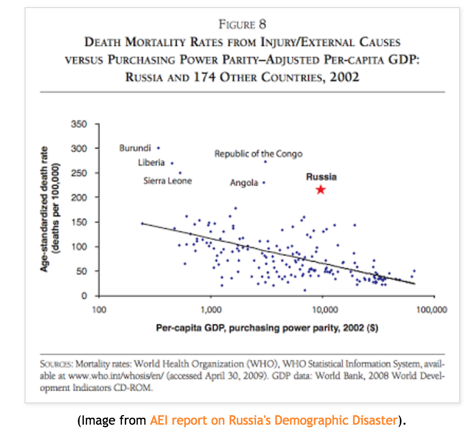
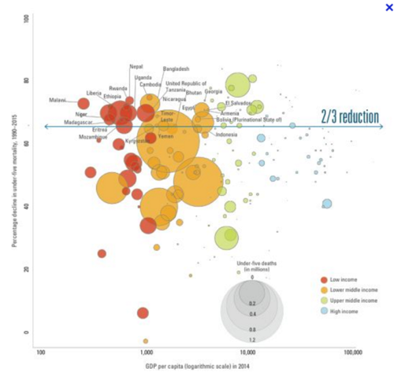
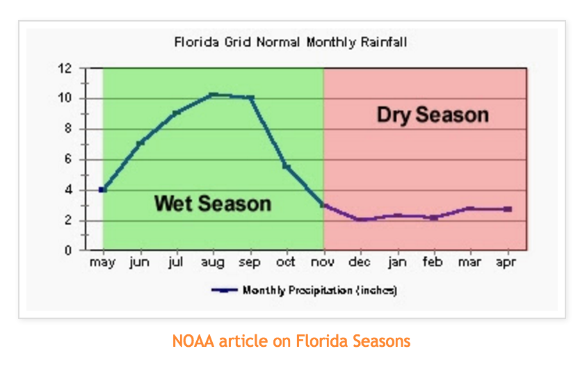
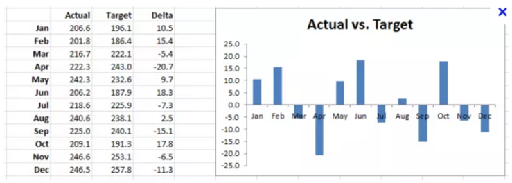
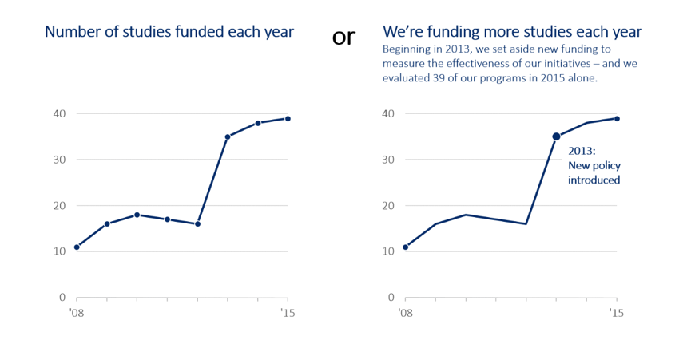

# Storytelling with Data

## Data storytelling

* [Forbes article](https://www.forbes.com/sites/brentdykes/2016/03/31/data-storytelling-the-essential-data-science-skill-everyone-needs/#1264193f52ad)

## Data Journalism

Stepping thru a data story:

* http://fivethirtyeight.com/features/gun-deaths/

* http://www.nytimes.com/interactive/2014/03/31/science/motorcycle-helmet-laws.html

* The "Stepper" is just like Tableau's text buttons in a story: http://www.nytimes.com/interactive/2013/02/04/science/girls-lead-in-science-exam-but-not-in-the-united-states.html

* Academic article reviewing techniques in data stories: http://vis.stanford.edu/files/2010-Narrative-InfoVis.pdf

## Data Exploration for your in-class and project work:

look for

* Outliers - values very different from the rest
* Groups (by continent, year, etc)
* Trends over time
* Top N (10, 20…)
* Calculate Differences (gain - loss, etc)

If you find something interesting, then look into WHY. (Dive deeper.)

### Outliers: How to "Use" Them In a Story

If you have multiple outliers, what makes them similar or surprising?

Read [Nathan Yau's advice](http://flowingdata.com/2018/03/07/visualizing-outliers/)

### Groups - Can You Find or Make Them?

Coloring countries by a few categories so you can compare the groups:

Sometimes the data reveal a pattern you can then "explain" or work with further:

### Calculate Differences

### Ask Yourself, like a Journalist:

* Who, what, when, why, where…
* Summarize all the data (histograms too)
* Are there any surprises?
* If so, what if you dive into that group/category/time period deeper.

## Reminders for your story

Ann K Emery [4 Storytelling Strategies](annkemery.com/four-storytelling-strategies/)

## Hans Rosling

The most famous example of storytelling: [Hans Rosling's video](https://www.ted.com/talks/hans_rosling_shows_the_best_stats_you_ve_ever_seen?language=en)

He relies on
* animation
* and narration
* and pointing at parts of the graph.  Especially outliers.

What if you have static (not animated) charts?  What points would you show?
Let’s try it…  When you watch it, I want you to take notes on the "main points" he makes.  What are the story points if you made it as a static story?

This is an in-class exercise to turn in. (Put your name on your paper legibly.)

## Story-telling in Tableau

* https://eagereyes.org/blog/2013/story-points

* Read: http://kosara.net/papers/2013/Kosara_Computer_2013.pdf

* http://storiesthroughdata.blogs.lincoln.ac.uk/2013/04/12/visualising-data-can-you-see-stories/

## Links on Using Tableau Storypoints

* [help docs on story points](http://onlinehelp.tableau.com/current/pro/desktop/en-us/help.htm#qs_stories.html)
* [help on sharing stories](http://onlinehelp.tableau.com/current/pro/desktop/en-us/help.htm#stories.html%3FTocPath%3DPublish%2520and%2520Share%7CStories%7C_____0)
* [Ins and Outs of Stories](https://tc14.tableau.com/schedule/content/961)
* [Earthquake story walkthru](http://onlinehelp.tableau.com/current/pro/desktop/en-us/help.htm#story_example.html)
* [The Earthquake Workbook](https://public.tableau.com/profile/tableau.docs.team#!/vizhome/EarthquakeTrendStoryExample/Earthquakestory)

## Dashboards

http://www.susielu.com/data-viz/storytelling-in-dashboards

Book rec: http://bigbookofdashboards.com/
